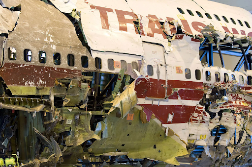

# Airline Industry: Risk Assessment

    

    

## Overview

This project analyses an aviation accident dataset from the National Transportation Safety Board which contains information about civil aviation accidents and selected incidents within the United States, its territories and possessions, and in international waters. We analyze this data to conclude which make and model are recommendaded, i.e. have lower risk of getting into an accident where the plane is damaged and people are injured for new commercial and private enterprises.

## Business Problem

    

    

Analyzing the data contaimed in this dataset can allow us understand what are the best features that correlate with a lower risk of buying an aircraft for our enterprises. A lower risk includes both a lower chance of damaging the aircraft and injurying a passenger or flight worker. This analyze allow us to not only promote safer travels, but also prevents the company from going bankrupt after incidents that hurt clients, like TWA, featured above. We describe our data cleaning process, filters we use to and our commendations.

## Data Understanding

    

    

The National Transportation Safety Board  provides information starting from 1948 and has almost 90 thousand entries of aviation accident. Every accident gets tagged with ID, dates, location, weather, report status, number of people injured and many other features that can help us understand the cause and consequence of what happened.

We are interested in minimizing the number of accidents in order to minimize passengers getting injured.

Our initial analysis finds that the quantity that best correlates with passenger injuries/safety is the number of accidents each make/company has had in the past.

    

    

Getting a correlation of 0.9938012534700585 between total number of injured people by the Make's planes and total number of accidents is our main lead to assess risk of purchasing an aircraft. We can drop features that are not correlated. 

Finally, we filter the data to the top makers. When starting a new company, we would need a large quantity of planes from the same model and make and only one of the top companies could do that.

The top companies are 'Embraer' , 'Bombardier', 'Textron Aviation', 'Airbus', 'Boeing', 'Pilatus', 'Pilatus Aircraft', 'Honda Aircraft','Mitsubishi','Gulfstream Aerospace','Gulfstream','Sukhoi','Dassault','Antonov' but they might have different names in the data set so need to find their other names in order to change them

## Data Analysis

First let us start counting the number of accidents each company has since 2000, and then see how the number of them changed over the years

    

    

7 companies make the cut (Mitsubish meets the threshold) and they are: Dassault, Textron, Bombardier, Honda, Airbus, Antonov and Sukhoi. Textron Aviation provides airplanes for Cessna, who has a lot of accidents and injuries so we decide to not go along with them too.

Now we work on the time series of makes who made the cut

    

We notice a sharp increase in the number of accidents since the 2000's started, probably caused by commercial flights becoming more popular. Air bus is the company that has most accidents in those, but it also has a larger share of the market. Honda has almost no accidents but it is a new company in this sector. Other companies are military or Russian and might be embargoed.

## Conclusions

Our analysis leads us to 3 recommendations on the make and models of aircrafts to start our enterprise:
- For a commercial fleet: Airbus A320;
- For a private fleet: Bombardier CL-600-2B16 ;
- For next purchases we can track HC-420 by Honda Aircraft Company as this is a company that just recently joined this market but has not have had a lot of accidents and injuries therefore, we do not possess enough data to make a good decision.

## Next Steps

Further analysis can enrich our decision accuracy on costs of investment and might include:
- Assess long term maintenance cost for each aircraft;
- Look at higher risk airports/locations so these places are avoid alongside with accidents;
- Include weather analysis as some models might have underperfomed in conditions like heavy rain or snow.

