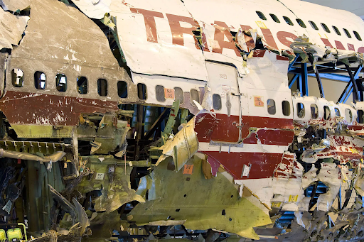
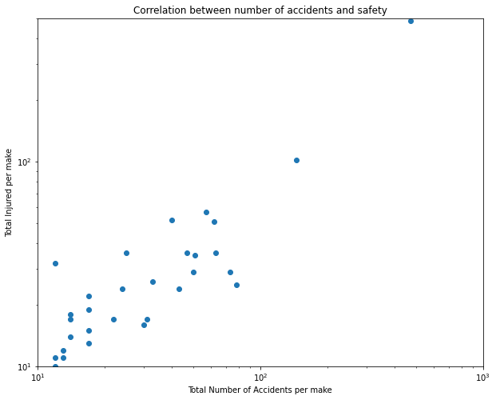
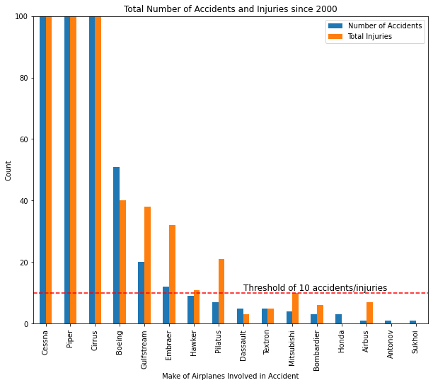

# Airline Industry: Risk Assessment


```python
from PIL import Image
fig1 = Image.open('images/plane1.jpg')
display(fig1)
```


    

    


## Overview

This project analyses an aviation accident dataset from the National Transportation Safety Board which contains information about civil aviation accidents and selected incidents within the United States, its territories and possessions, and in international waters. We analyze this data to conclude which make and model are recommendaded, i.e. have lower risk of getting into an accident where the plane is damaged and people are injured for new commercial and private enterprises.

## Business Problem


```python
fig1 = Image.open('images/plane_destroyed.png')
display(fig1)
```


    

    


Analyzing the data contaimed in this dataset can allow us understand what are the best features that correlate with a lower risk of buying an aircraft for our enterprises. A lower risk includes both a lower chance of damaging the aircraft and injurying a passenger or flight worker. This analyze allow us to not only promote safer travels, but also prevents the company from going bankrupt after incidents that hurt clients, like TWA, featured above. We describe our data cleaning process, filters we use to and our commendations.

## Data Understanding


```python
fig1 = Image.open('images/plane2.jpeg')
display(fig1)
```


    

    


The National Transportation Safety Board  provides information starting from 1948 and has almost 90 thousand entries of aviation accident. Every accident gets tagged with ID, dates, location, weather, report status, number of people injured and many other features that can help us understand the cause and consequence of what happened.

We are interested in minimizing the number of accidents in order to minimize passengers getting injured.


```python
#We import useful packages for this project
from PIL import Image
import pandas as pd
import numpy as np
import matplotlib.pyplot as plt

#Avoiding lengthy warnings
import warnings
from pandas.errors import SettingWithCopyWarning
warnings.simplefilter(action='ignore', category=(SettingWithCopyWarning))

%matplotlib inline
```


```python
#We read the csv file containing the data and rename columns/features to be more readable
pd.set_option('display.max_columns',100)
df = pd.read_csv('data/AviationData.csv', encoding='latin1', low_memory='False')
#Makes columns easier to read
df.rename(columns={u:str(u).replace('.', ' ').title() for u in list(df.columns)},inplace=True)
df.head()
```

    <ipython-input-5-cd2cce508361>:3: DtypeWarning: Columns (6,7,28) have mixed types. Specify dtype option on import or set low_memory=False.
      df = pd.read_csv('data/AviationData.csv', encoding='latin1', low_memory='False')


<div>
<style scoped>
    .dataframe tbody tr th:only-of-type {
        vertical-align: middle;
    }

    .dataframe tbody tr th {
        vertical-align: top;
    }

    .dataframe thead th {
        text-align: right;
    }
</style>
<table border="1" class="dataframe">
  <thead>
    <tr style="text-align: right;">
      <th></th>
      <th>Event Id</th>
      <th>Investigation Type</th>
      <th>Accident Number</th>
      <th>Event Date</th>
      <th>Location</th>
      <th>Country</th>
      <th>Latitude</th>
      <th>Longitude</th>
      <th>Airport Code</th>
      <th>Airport Name</th>
      <th>Injury Severity</th>
      <th>Aircraft Damage</th>
      <th>Aircraft Category</th>
      <th>Registration Number</th>
      <th>Make</th>
      <th>Model</th>
      <th>Amateur Built</th>
      <th>Number Of Engines</th>
      <th>Engine Type</th>
      <th>Far Description</th>
      <th>Schedule</th>
      <th>Purpose Of Flight</th>
      <th>Air Carrier</th>
      <th>Total Fatal Injuries</th>
      <th>Total Serious Injuries</th>
      <th>Total Minor Injuries</th>
      <th>Total Uninjured</th>
      <th>Weather Condition</th>
      <th>Broad Phase Of Flight</th>
      <th>Report Status</th>
      <th>Publication Date</th>
    </tr>
  </thead>
  <tbody>
    <tr>
      <th>0</th>
      <td>20001218X45444</td>
      <td>Accident</td>
      <td>SEA87LA080</td>
      <td>1948-10-24</td>
      <td>MOOSE CREEK, ID</td>
      <td>United States</td>
      <td>NaN</td>
      <td>NaN</td>
      <td>NaN</td>
      <td>NaN</td>
      <td>Fatal(2)</td>
      <td>Destroyed</td>
      <td>NaN</td>
      <td>NC6404</td>
      <td>Stinson</td>
      <td>108-3</td>
      <td>No</td>
      <td>1.0</td>
      <td>Reciprocating</td>
      <td>NaN</td>
      <td>NaN</td>
      <td>Personal</td>
      <td>NaN</td>
      <td>2.0</td>
      <td>0.0</td>
      <td>0.0</td>
      <td>0.0</td>
      <td>UNK</td>
      <td>Cruise</td>
      <td>Probable Cause</td>
      <td>NaN</td>
    </tr>
    <tr>
      <th>1</th>
      <td>20001218X45447</td>
      <td>Accident</td>
      <td>LAX94LA336</td>
      <td>1962-07-19</td>
      <td>BRIDGEPORT, CA</td>
      <td>United States</td>
      <td>NaN</td>
      <td>NaN</td>
      <td>NaN</td>
      <td>NaN</td>
      <td>Fatal(4)</td>
      <td>Destroyed</td>
      <td>NaN</td>
      <td>N5069P</td>
      <td>Piper</td>
      <td>PA24-180</td>
      <td>No</td>
      <td>1.0</td>
      <td>Reciprocating</td>
      <td>NaN</td>
      <td>NaN</td>
      <td>Personal</td>
      <td>NaN</td>
      <td>4.0</td>
      <td>0.0</td>
      <td>0.0</td>
      <td>0.0</td>
      <td>UNK</td>
      <td>Unknown</td>
      <td>Probable Cause</td>
      <td>19-09-1996</td>
    </tr>
    <tr>
      <th>2</th>
      <td>20061025X01555</td>
      <td>Accident</td>
      <td>NYC07LA005</td>
      <td>1974-08-30</td>
      <td>Saltville, VA</td>
      <td>United States</td>
      <td>36.922223</td>
      <td>-81.878056</td>
      <td>NaN</td>
      <td>NaN</td>
      <td>Fatal(3)</td>
      <td>Destroyed</td>
      <td>NaN</td>
      <td>N5142R</td>
      <td>Cessna</td>
      <td>172M</td>
      <td>No</td>
      <td>1.0</td>
      <td>Reciprocating</td>
      <td>NaN</td>
      <td>NaN</td>
      <td>Personal</td>
      <td>NaN</td>
      <td>3.0</td>
      <td>NaN</td>
      <td>NaN</td>
      <td>NaN</td>
      <td>IMC</td>
      <td>Cruise</td>
      <td>Probable Cause</td>
      <td>26-02-2007</td>
    </tr>
    <tr>
      <th>3</th>
      <td>20001218X45448</td>
      <td>Accident</td>
      <td>LAX96LA321</td>
      <td>1977-06-19</td>
      <td>EUREKA, CA</td>
      <td>United States</td>
      <td>NaN</td>
      <td>NaN</td>
      <td>NaN</td>
      <td>NaN</td>
      <td>Fatal(2)</td>
      <td>Destroyed</td>
      <td>NaN</td>
      <td>N1168J</td>
      <td>Rockwell</td>
      <td>112</td>
      <td>No</td>
      <td>1.0</td>
      <td>Reciprocating</td>
      <td>NaN</td>
      <td>NaN</td>
      <td>Personal</td>
      <td>NaN</td>
      <td>2.0</td>
      <td>0.0</td>
      <td>0.0</td>
      <td>0.0</td>
      <td>IMC</td>
      <td>Cruise</td>
      <td>Probable Cause</td>
      <td>12-09-2000</td>
    </tr>
    <tr>
      <th>4</th>
      <td>20041105X01764</td>
      <td>Accident</td>
      <td>CHI79FA064</td>
      <td>1979-08-02</td>
      <td>Canton, OH</td>
      <td>United States</td>
      <td>NaN</td>
      <td>NaN</td>
      <td>NaN</td>
      <td>NaN</td>
      <td>Fatal(1)</td>
      <td>Destroyed</td>
      <td>NaN</td>
      <td>N15NY</td>
      <td>Cessna</td>
      <td>501</td>
      <td>No</td>
      <td>NaN</td>
      <td>NaN</td>
      <td>NaN</td>
      <td>NaN</td>
      <td>Personal</td>
      <td>NaN</td>
      <td>1.0</td>
      <td>2.0</td>
      <td>NaN</td>
      <td>0.0</td>
      <td>VMC</td>
      <td>Approach</td>
      <td>Probable Cause</td>
      <td>16-04-1980</td>
    </tr>
  </tbody>
</table>
</div>


```python
#We get basic information from the columns and check missing values
df.info()
```

    <class 'pandas.core.frame.DataFrame'>
    RangeIndex: 88889 entries, 0 to 88888
    Data columns (total 31 columns):
     #   Column                  Non-Null Count  Dtype  
    ---  ------                  --------------  -----  
     0   Event Id                88889 non-null  object 
     1   Investigation Type      88889 non-null  object 
     2   Accident Number         88889 non-null  object 
     3   Event Date              88889 non-null  object 
     4   Location                88837 non-null  object 
     5   Country                 88663 non-null  object 
     6   Latitude                34382 non-null  object 
     7   Longitude               34373 non-null  object 
     8   Airport Code            50132 non-null  object 
     9   Airport Name            52704 non-null  object 
     10  Injury Severity         87889 non-null  object 
     11  Aircraft Damage         85695 non-null  object 
     12  Aircraft Category       32287 non-null  object 
     13  Registration Number     87507 non-null  object 
     14  Make                    88826 non-null  object 
     15  Model                   88797 non-null  object 
     16  Amateur Built           88787 non-null  object 
     17  Number Of Engines       82805 non-null  float64
     18  Engine Type             81793 non-null  object 
     19  Far Description         32023 non-null  object 
     20  Schedule                12582 non-null  object 
     21  Purpose Of Flight       82697 non-null  object 
     22  Air Carrier             16648 non-null  object 
     23  Total Fatal Injuries    77488 non-null  float64
     24  Total Serious Injuries  76379 non-null  float64
     25  Total Minor Injuries    76956 non-null  float64
     26  Total Uninjured         82977 non-null  float64
     27  Weather Condition       84397 non-null  object 
     28  Broad Phase Of Flight   61724 non-null  object 
     29  Report Status           82505 non-null  object 
     30  Publication Date        75118 non-null  object 
    dtypes: float64(5), object(26)
    memory usage: 21.0+ MB


```python
#The describe method allows us to check statistics of the (few) numerical feautures we have in teh dataset.
#We further explore the data in the next section.
df.describe()
```


<div>
<style scoped>
    .dataframe tbody tr th:only-of-type {
        vertical-align: middle;
    }

    .dataframe tbody tr th {
        vertical-align: top;
    }

    .dataframe thead th {
        text-align: right;
    }
</style>
<table border="1" class="dataframe">
  <thead>
    <tr style="text-align: right;">
      <th></th>
      <th>Number Of Engines</th>
      <th>Total Fatal Injuries</th>
      <th>Total Serious Injuries</th>
      <th>Total Minor Injuries</th>
      <th>Total Uninjured</th>
    </tr>
  </thead>
  <tbody>
    <tr>
      <th>count</th>
      <td>82805.000000</td>
      <td>77488.000000</td>
      <td>76379.000000</td>
      <td>76956.000000</td>
      <td>82977.000000</td>
    </tr>
    <tr>
      <th>mean</th>
      <td>1.146585</td>
      <td>0.647855</td>
      <td>0.279881</td>
      <td>0.357061</td>
      <td>5.325440</td>
    </tr>
    <tr>
      <th>std</th>
      <td>0.446510</td>
      <td>5.485960</td>
      <td>1.544084</td>
      <td>2.235625</td>
      <td>27.913634</td>
    </tr>
    <tr>
      <th>min</th>
      <td>0.000000</td>
      <td>0.000000</td>
      <td>0.000000</td>
      <td>0.000000</td>
      <td>0.000000</td>
    </tr>
    <tr>
      <th>25%</th>
      <td>1.000000</td>
      <td>0.000000</td>
      <td>0.000000</td>
      <td>0.000000</td>
      <td>0.000000</td>
    </tr>
    <tr>
      <th>50%</th>
      <td>1.000000</td>
      <td>0.000000</td>
      <td>0.000000</td>
      <td>0.000000</td>
      <td>1.000000</td>
    </tr>
    <tr>
      <th>75%</th>
      <td>1.000000</td>
      <td>0.000000</td>
      <td>0.000000</td>
      <td>0.000000</td>
      <td>2.000000</td>
    </tr>
    <tr>
      <th>max</th>
      <td>8.000000</td>
      <td>349.000000</td>
      <td>161.000000</td>
      <td>380.000000</td>
      <td>699.000000</td>
    </tr>
  </tbody>
</table>
</div>


## Data Preparation explained

### Data cleaning and feature engineering

We first start our analysis by cleaning the data by checking the values of each column.


```python
df['Aircraft Category'].value_counts()
```


    Aircraft Category
    Airplane             27617
    Helicopter            3440
    Glider                 508
    Balloon                231
    Gyrocraft              173
    Weight-Shift           161
    Powered Parachute       91
    Ultralight              30
    Unknown                 14
    WSFT                     9
    Powered-Lift             5
    Blimp                    4
    UNK                      2
    Rocket                   1
    ULTR                     1
    Name: count, dtype: int64


```python
# We are only interested in Airplanes, so we filter other categories out
df = df[df['Aircraft Category']=='Airplane']
df.drop('Aircraft Category', axis=1, inplace=True)
```


```python
df['Purpose Of Flight'].value_counts()
```


    Purpose Of Flight
    Personal                     16154
    Instructional                 3212
    Aerial Application            1068
    Unknown                        886
    Business                       785
    Positioning                    359
    Flight Test                    226
    Ferry                          176
    Aerial Observation             170
    Skydiving                      166
    Other Work Use                 158
    Executive/corporate            151
    Banner Tow                      89
    Air Race show                   74
    Public Aircraft - Federal       53
    Public Aircraft                 43
    Glider Tow                      35
    Public Aircraft - State         24
    Firefighting                    17
    Public Aircraft - Local         12
    Air Race/show                    7
    ASHO                             6
    Air Drop                         3
    PUBS                             3
    External Load                    1
    Name: count, dtype: int64


```python
#We restrict the data to accidents that only happened during certain purposes too.
#If an accident happened when the airplane was firefighting, it is unlikely that we will face the same in our business endeavours.
purposes_of_interest = ['Personal','Business','Flight Test','Other Work Use','Executive/corporate']
df = df[df['Purpose Of Flight'].isin(purposes_of_interest)]
```


```python
df['Investigation Type'].value_counts()
```


    Investigation Type
    Accident    17303
    Incident      171
    Name: count, dtype: int64


```python
#We also drop all the incidents because they have been prevented, keeping only accidents.
#After that no need to keep the Investigation.Type column.
df = df[df['Investigation Type']=='Accident']
df.drop('Investigation Type',axis=1, inplace=True)
```


```python
dict(df['Report Status'].value_counts())
```


    {'Probable Cause': 4262,
     'Foreign': 63,
     "The pilot's failure to maintain directional control during the landing roll.": 50,
     "The pilot's failure to maintain directional control during landing.": 36,
     'A loss of engine power for undetermined reasons.': 33,
     'A total loss of engine power for undetermined reasons.': 26,
     'The loss of engine power for undetermined reasons.': 21,
     'The pilot\x92s failure to maintain directional control during the landing roll.\r\n\r': 20,
     'The pilot\x92s failure to maintain directional control during the landing roll.': 19,
     'The pilot\x92s failure to maintain directional control during landing.': 15,
     "The pilot's failure to maintain directional control of the airplane during landing.": 15,
     "The pilot's improper recovery from a bounced landing.": 15,
     "The pilot's failure to maintain directional control during the takeoff roll.": 13,
     'The pilot\x92s failure to maintain directional control during landing.\r\n\r': 12,
     "The pilot's improper landing flare, which resulted in a hard landing.": 12,
     "The pilot's failure to maintain directional control during takeoff.": 12,
     "The pilot's failure to maintain directional control while landing.": 9,
     '<br /><br />': 9,
     'The pilot\x92s improper landing flare, which resulted in a hard landing.\r\n\r': 8,
     "The pilot's failure to maintain directional control during the landing roll, which resulted in a ground loop.": 8,
     'A partial loss of engine power for undetermined reasons.': 8,
     "The pilot's improper fuel management, which resulted in a loss of engine power due to fuel starvation.": 7,
     "The pilot's improper fuel management, which resulted in a loss of engine power due to fuel exhaustion.": 7,
     "The pilot's loss of directional control during landing.": 7,
     "The pilot's failure to maintain directional control.": 7,
     'The pilot\x92s improper fuel management, which resulted in a loss of engine power due to fuel exhaustion.': 7,
     "The pilot's failure to maintain directional control during the landing roll, which resulted in a runway excursion.": 7,
     'The pilot\x92s failure to maintain directional control during landing.\r': 6,
     'A total loss of engine power for reasons that could not be determined based on the available information.': 6,
     'A total loss of engine power for reasons that could not be determined based on the available information.\r': 6,
     'The total loss of engine power for undetermined reasons.': 6,
     "The pilot's failure to maintain directional control while landing with a crosswind.": 6,
     'The pilot did not maintain directional control during the landing roll.': 6,
     "The pilot's failure to maintain directional control of the airplane during the landing roll.": 6,
     "The pilot's selection of unsuitable terrain for landing.": 6,
     "The pilot's inadequate flare, which resulted in a hard landing.": 6,
     "The pilot's improper landing flare.": 6,
     "The pilot's improper landing flare and inadequate recovery from a bounced landing.": 6,
     'The pilot\x92s improper recovery from a bounced landing.': 6,
     "The pilot's improper flare, which resulted in a hard landing.": 5,
     'A partial loss of engine power for reasons that could not be determined based on the available information.\r': 5,
     "The pilot's failure to maintain directional control during the landing.": 5,
     'A loss of engine power for reasons that could not be determined based on the available information.': 5,
     'The pilot\x92s failure to maintain directional control during takeoff.': 5,
     'The total loss of engine power for reasons that could not be determined based on the available evidence.\r': 5,
     "The pilot's inadequate recovery from a bounced landing.": 5,
     "The pilot's failure to maintain directional control during landing.\r": 5,
     "The pilot's failure to maintain directional control during landing, which resulted in a ground loop.\r": 5,
     "The pilot's failure to maintain directional control during the landing roll in crosswind conditions.": 5,
     "The pilot's inadequate fuel planning, which resulted in a total loss of engine power due to fuel exhaustion.": 5,
     'A total loss of engine power for undetermined reasons.\r': 5,
     'The pilot\x92s loss of directional control during the landing roll, which resulted in a runway excursion.': 5,
     'The loss of engine power due to fuel starvation.': 4,
     "The pilot's improper landing flare which resulted in a hard landing.": 4,
     'Under the jurisdiction and control of the French government.': 4,
     'The pilot\x92s failure to maintain directional control during takeoff.\r\n\r': 4,
     'The pilot\x92s failure to maintain directional control during the landing roll. \r': 4,
     "The pilot's failure to maintain directional control during the landing flare.": 4,
     "A loss of engine power due to fuel exhaustion as a result of the pilot's inadequate fuel planning.": 4,
     "The pilot's failure to maintain control of the airplane during landing.": 4,
     "The pilot's selection of an unsuitable landing area.": 4,
     "The pilot's failure to maintain directional control during a crosswind landing.": 4,
     "The pilot's improper fuel management, which resulted in a total loss of engine power due to fuel starvation.": 4,
     'The pilot\x92s failure to maintain directional control during the landing roll.\r': 4,
     "The pilot's failure to maintain aircraft control during landing.": 4,
     'The pilot\x92s improper landing flare, which resulted in a bounced landing.\r\n\r': 4,
     "The pilot's improper landing flare and recovery from a bounced landing.": 4,
     'The pilot\x92s failure to maintain directional control during the landing roll. \r\n\r': 4,
     "The pilot's inadequate directional control during the landing roll.": 4,
     'The pilot\x92s failure to maintain directional control of the airplane during the landing roll.': 4,
     'The loss of engine power during initial climb for undetermined reasons.': 4,
     "The pilot's selection of unsuitable terrain for landing, which resulted in a nose over.": 4,
     'The pilot\x92s improper flare, which resulted in a hard landing.': 4,
     "The pilot's improper flare during landing.": 4,
     "The pilot's failure to maintain directional control while landing in a crosswind.": 4,
     "The pilot's failure to maintain directional control during the landing rollout.": 4,
     'The pilot\x92s improper fuel management, which resulted in a loss of engine power due to fuel starvation.': 4,
     'A loss of aircraft control for undetermined reasons.': 4,
     "A loss of engine power due to fuel starvation as a result of the pilot's inadequate fuel management.": 3,
     "The pilot's improper flare which resulted in a hard landing.": 3,
     'The pilot\x92s failure to maintain directional control during landing in gusting crosswind conditions.\r\n\r': 3,
     'The pilot\x92s failure to extend the landing gear before landing.': 3,
     "The pilot's failure to extend the landing gear.": 3,
     'A loss of engine power for reasons that could not be determined based on the available information.\r': 3,
     'A total loss of engine power for reasons that could not be determined based on the available information. \r': 3,
     "The pilot's failure to maintain directional control during the landing roll in crosswind conditions, which resulted in a ground loop.": 3,
     "The pilot's loss of control for undetermined reasons.": 3,
     'The loss of engine power due to carburetor icing.\r': 3,
     'A loss of engine power due to carburetor icing.': 3,
     "The pilot's failure to maintain aircraft control during the landing roll.": 3,
     "The pilot's decision to fly at a low altitude in mountainous terrain and weather conditions conducive to downdrafts.": 3,
     "The pilot's improper recovery from a bounced landing, which resulted in a loss of control.": 3,
     "The pilot's failure to ensure that the landing gear was retracted for the water landing.": 3,
     "The pilot's failure to maintain aircraft control during takeoff.": 3,
     "The pilot's loss of directional control during landing, resulting in a collision with terrain.": 3,
     "The pilot's failure to maintain directional control during landing, which resulted in a ground loop.": 3,
     "The pilot's improper decision to land on an unsuitable landing surface which resulted in a nose over.": 3,
     'The pilot did not maintain adequate airspeed during takeoff, which resulted in an aerodynamic stall.': 3,
     'The partial loss of engine power for undetermined reasons.': 3,
     'A total loss of engine power for reasons that could not be determined because postaccident examination of the airframe and engine did not reveal any anomalies that would have precluded normal operation.': 3,
     "A loss of engine power due to carburetor icing as a result of the pilot's failure to use carburetor heat.": 3,
     'The pilot\x92s selection of unsuitable terrain for landing, which resulted in a nose-over.\r\n\r': 3,
     'The pilot\x92s loss of directional control during landing.\r': 3,
     'The pilot\x92s improper landing flare, which resulted in a hard landing.': 3,
     "The pilot's delayed decision to abort the takeoff.": 3,
     "The pilot's inadequate landing flare, which resulted in a bounced landing.": 3,
     'An in-flight fire for undetermined reasons.': 3,
     'The pilot\x92s failure to maintain directional control during the landing roll in gusting wind conditions.\r\n\r': 3,
     'The pilot\x92s improper fuel management, which resulted in a total loss of engine power due to fuel starvation.': 3,
     'The pilot\x92s failure to maintain directional control during the takeoff roll.\r\n\r': 3,
     "The pilot's failure to maintain directional control during landing with a crosswind.": 3,
     "The pilot's failure to maintain control of the airplane during takeoff.": 3,
     "The pilot's failure to extend the landing gear before landing.\r": 3,
     "The pilot's failure to maintain directional control of the airplane during takeoff.": 3,
     'An in-flight collision with a bird.': 3,
     'A total loss of engine power during initial climb for undetermined reasons.': 3,
     'The pilot\x92s failure to maintain directional control while landing in gusting wind conditions.\r\n\r': 3,
     "The pilot's improper landing flare, which resulted in a hard landing.\r\n\r\n\r": 3,
     "The pilot's failure to maintain airplane control during landing.": 3,
     'A partial loss of engine power during initial climb for undetermined reasons.': 3,
     "The pilot's failure to extend the landing gear prior to landing, which resulted in substantial damage to the fuselage during landing.": 3,
     'The pilot\x92s failure to maintain directional control while landing in crosswind conditions.\r\n\r': 3,
     "The pilot's failure to maintain directional control of the airplane during the takeoff roll.": 3,
     "The pilot's failure to maintain aircraft control during the landing.": 3,
     "The pilot's failure to maintain directional control while landing, resulting in a ground loop and substantial damage to the airplane.": 3,
     'The pilot\x92s failure to maintain directional control during the landing roll in crosswind conditions.\r\n\r': 3,
     'The pilot\x92s failure to maintain directional control during the landing roll with a tailwind.\r\n\r': 3,
     "The pilot's inadequate landing flare, which resulted in a hard landing.": 3,
     'The pilot\x92s failure to maintain directional control of the airplane during landing.': 3,
     "The pilot's failure to lower the landing gear prior to landing.": 3,
     "The pilot's failure to maintain directional control during the landing roll, which resulted in a runway excursion and a nose over.": 3,
     'The loss of engine power for an undetermined reason.': 2,
     'Impact with terrain for reasons that could not be determined based on the available information.': 2,
     'A total loss of engine power due to fuel exhaustion.': 2,
     "The pilot's improper landing flare, which resulted in a hard, bounced landing.": 2,
     "The pilot's improper fuel planning, which resulted in a loss of engine power due to fuel exhaustion.": 2,
     'The pilot\x92s loss of directional control during the landing roll.': 2,
     'The pilot did not maintain adequate airspeed during a go-around, which resulted in an aerodynamic stall.': 2,
     'The pilot\x92s failure to lower the landing gear prior to landing.': 2,
     'The pilot\x92s failure to maintain directional control during the landing roll, which resulted in a runway excursion. \r\n\r': 2,
     "The pilot's selection of unsuitable terrain for landing, resulting in a nose over.": 2,
     "The pilot's loss of control due to spatial disorientation.": 2,
     "The pilot's improper fuel planning, which resulted in a total loss of engine power due to fuel exhaustion.": 2,
     "The pilot's failure to maintain directional control during a go-around.": 2,
     "The pilot's failure to maintain clearance from trees.": 2,
     'An in-flight loss of control for reasons that could not be determined based on the available evidence.': 2,
     "The pilot's failure to maintain directional control while landing in gusting wind conditions.": 2,
     'The pilot\x92s failure to maintain directional control during the landing rollout.': 2,
     "The pilot's failure to maintain control of the airplane while taking off with a gusting crosswind.": 2,
     'A partial loss of engine power for undetermined reasons.\r': 2,
     "The pilot's selection of an unsuitable takeoff area with an unfavorable wind.": 2,
     "The pilot's failure to maintain aircraft control while landing.": 2,
     'A loss of engine power due to fuel exhaustion.': 2,
     "The pilot's improper landing flare, which resulted in a hard landing.\r": 2,
     "The pilot's excessive braking during the landing roll.": 2,
     'A loss of engine power during initial climb for reasons that could not be determined because postaccident examination did not reveal any anomalies that would have precluded normal operation.': 2,
     "The pilot's failure to maintain directional control of the airplane while landing with gusting winds.": 2,
     'A total loss of engine power due to fuel starvation.\r': 2,
     "The pilot's loss of directional control during the landing roll, which resulted in a runway excursion.": 2,
     'The pilot\x92s improper recovery from a bounced landing.\r': 2,
     'The pilot\x92s failure to maintain directional control during taxi, which resulted in a runway excursion.': 2,
     "The pilot's failure to lower the landing gear prior to touchdown.": 2,
     'A total loss of engine power during the initial climb after takeoff for undetermined reasons.': 2,
     'The pilot\x92s failure to maintain directional control while landing in a gusting crosswind.': 2,
     'The pilot\x92s improper fuel management, which resulted in a total loss of engine power due to fuel starvation.\r\n\r': 2,
     "The pilot's failure to extend the landing gear for landing.": 2,
     'A partial loss of engine power for reasons that could not be determined because postaccident examination did not reveal any anomalies that would have precluded normal operation.': 2,
     'A loss of engine power for an undetermined reason.': 2,
     "The pilot's loss of control during landing for undetermined reasons.": 2,
     'The pilot\x92s improper landing flare and subsequent failure to maintain directional control during landing.\r\n\r': 2,
     'The loss of engine power for undetermined reasons.\r': 2,
     "The pilot's failure to maintain clearance from terrain while maneuvering at low altitude.": 2,
     "The pilot's failure to obtain the proper touchdown point during landing.": 2,
     "The pilot's failure to see and avoid power lines during final approach to landing.": 2,
     'The pilot\x92s failure to maintain directional control during the landing roll, which resulted in a ground loop.': 2,
     'The pilot\x92s improper flare and recovery from a bounced landing.': 2,
     'A loss of directional control on takeoff for undetermined reasons.': 2,
     "The pilot's failure to maintain clearance from obstacles.": 2,
     "The pilot's inadequate pre-flight planning and in-flight monitoring of the fuel level which resulted in a total loss of engine power due to fuel exhaustion.": 2,
     "The pilot's failure to maintain directional control during landing in gusting wind conditions.": 2,
     "The pilot's selection of unsuitable terrain for landing, which resulted in a nose-over. \r\n\r\n\r": 2,
     "The pilot's inadequate preflight planning, which resulted in a loss of engine power due to fuel exhaustion.": 2,
     'The pilot\x92s failure to execute a go-around following an approach that was high and fast, which resulted in a runway overrun.': 2,
     'A total loss of engine power for reasons that could not be determined based on the available evidence. \r': 2,
     "The pilot's decision to make contact with an unsuitable landing surface, resulting in a nose over.": 2,
     "The pilot's failure to properly secure the airplane before hand-propping the engine for startup.": 2,
     "The pilot's failure to use continuous carburetor heat while operating in conditions conducive to carburetor icing, which resulted in the development of carburetor ice and a subsequent partial loss of engine power.": 2,
     "The pilot's inadequate compensation for the wind condition, resulting in a runway excursion.": 2,
     'An inadvertent collision with a deer during landing.': 2,
     "The pilot's loss of directional control during the landing roll.": 2,
     "The pilot's delayed decision to abort the takeoff, which resulted in a runway excursion.": 2,
     "A total loss of engine power due to fuel starvation as a result of the pilot's improper fuel management.": 2,
     "The noninstrument-rated pilot's continued visual flight into instrument meteorological conditions, which resulted in controlled flight into mountainous terrain.": 2,
     "The pilot's failure to maintain directional control during the landing roll, which resulted in a runway excursion and impact with terrain.": 2,
     'The pilot did not maintain control of the airplane while landing with a crosswind.': 2,
     'Loss of engine power for undetermined reasons.': 2,
     "The pilot's failure to maintain directional control during the landing roll, which resulted in a ground-loop.": 2,
     'A loss of engine power for reasons that could not be determined because postaccident examination of the engine did not reveal any anomalies that would have precluded normal operation.': 2,
     "The pilot's improper use of brakes during the landing rollout.": 2,
     'The pilot\x92s improper fuel planning, which resulted in a total loss of engine power due to fuel exhaustion.\r': 2,
     'The pilot\x92s failure to extend the landing gear before landing. \r': 2,
     "The pilot's inadequate preflight planning and fuel management, which resulted in a total loss of engine power due to fuel exhaustion.": 2,
     "The pilot's loss of airplane control for reasons that could not be determined based on the available information.\r": 2,
     'The pilot\x92s delayed use of carburetor heat while operating in conditions conducive to carburetor icing.': 2,
     "The pilot's failure to maintain directional control while landing in a gusty crosswind.": 2,
     'The pilot\x92s improper flare and inadequate recovery from a bounced landing.': 2,
     "The pilot's loss of control for undetermined reasons.\r": 2,
     "The pilot's failure to extend the landing gear before landing.": 2,
     "The pilot's failure to maintain adequate airspeed which resulted in an aerodynamic stall.": 2,
     "The pilot's improper fuel management, which resulted in a total loss of engine power due to fuel exhaustion.": 2,
     "The pilot's excessive use of brakes during the landing roll resulting in a nose over.": 2,
     "The pilot's loss of directional control during landing, which resulted in a runway excursion.": 2,
     'A total loss of engine power for an undetermined reason.': 2,
     "The pilot's failure to obtain the proper touchdown point while landing.": 2,
     'The loss of engine power for reasons that could not be determined because postaccident examination of the airframe and engine did not reveal any anomalies that would have precluded normal operation.': 2,
     "The pilot's failure to maintain directional control during an attempted go-around, which resulted in a runway excursion and a collision with terrain.": 2,
     "The pilot's mismanagement of the available fuel, which resulted in a total loss of engine power due to fuel starvation.\r": 2,
     "The pilot's excessive brake application during the landing roll resulting in a nose over.": 2,
     "The pilot's failure to maintain directional control during landing. Contributing to the accident was the crosswind.": 2,
     'A total loss of engine power due to fuel starvation as a result of a clogged fuel filter.': 2,
     "The pilot's inadequate in-flight fuel management, which resulted in a total loss of engine power due to fuel starvation.": 2,
     'The pilot\x92s failure to maintain airplane control while landing in gusting wind conditions.': 2,
     'A loss of engine power, as reported by the pilot, for undetermined reasons.': 2,
     "The pilot's failure to select the proper fuel tank before departure, which resulted in fuel starvation and a total loss of engine power.\r\n\r": 2,
     'The loss of engine power due to fuel starvation.\r': 2,
     'A partial loss of engine power for reasons that could not be determined based on the available information. \r': 2,
     'The total loss of engine power due to fuel exhaustion.\r': 2,
     'The pilot\x92s failure to maintain directional control during a crosswind landing/rollout.': 2,
     "The pilot's failure to maintain directional control while landing in gusty crosswind conditions.": 2,
     'The pilot\x92s failure to maintain directional control during a crosswind landing.': 2,
     "The pilot's failure to maintain directional control during the landing, which resulted in a runway excursion and collision with terrain.": 2,
     "The pilot's improper flare.": 2,
     'The pilot\x92s improper preflight fuel planning, which resulted in fuel exhaustion and a subsequent total loss of engine power.\r': 2,
     "The pilot's inadequate compensation for the crosswind, which resulted in a loss of directional control.": 2,
     "The student pilot's failure to maintain directional control during takeoff.": 2,
     "The pilot's failure to maintain directional control of the airplane during the landing.": 2,
     "The pilot's failure to maintain directional control during the landing roll.\r": 2,
     'A loss of engine power for reasons that could not be determined based on the available evidence.\r': 2,
     'A total loss of engine power due to fuel exhaustion as a result of the pilot\x92s inadequate preflight fuel planning.': 2,
     "The pilot's failure to maintain directional control while landing in gusting crosswind conditions.": 2,
     'The pilot\x92s failure to maintain directional control during the takeoff roll.\r': 2,
     'The pilot\x92s inadequate preflight fuel planning, which resulted in a total loss of engine power due to fuel exhaustion.': 2,
     "The pilot's improper application of brakes during the landing rollout.": 2,
     "The pilot's encounter with a windshear/downdraft that exceeded the climb performance capabilities of the airplane.": 2,
     "The pilot's failure to maintain clearance from terrain during takeoff.": 2,
     'The loss of engine power during cruise flight for undetermined reasons.': 2,
     "The pilot's inadequate compensation for the crosswind during landing.": 2,
     "The pilot's inadequate compensation for the gusty crosswind conditions while landing.": 2,
     "The loss of engine power for undetermined reasons. Contributing to the accident was the pilot's failure to maintain aircraft control during the forced landing.": 2,
     'Undetermined (airplane and pilot missing).': 2,
     'A partial loss of engine power due to carburetor icing.': 2,
     "The pilot's improper use of brakes during landing.": 2,
     'The pilot\x92s failure to maintain directional control during landing in gusty crosswind conditions.': 2,
     "The pilot's failure to maintain directional control of the airplane during the crosswind landing.": 2,
     'The pilot\x92s suicidal act.': 2,
     "The pilot's inadequate compensation for the gusting wind conditions.": 2,
     'The pilot\x92s failure to maintain directional control during the takeoff, which resulted in a runway excursion.': 2,
     'The pilot\x92s failure to maintain directional control during taxi.': 2,
     'A total loss of engine power during initial climb for reasons that could not be determined because postaccident examination of the airframe and engine did not reveal any anomalies that would have precluded normal operation.': 2,
     "The pilot's failure to maintain directional control during the landing roll, which resulted in a ground loop. \r\n\r\n\r": 2,
     "A total loss of engine power in flight due to fuel exhaustion as a result of the pilot's inadequate fuel planning.": 2,
     "The pilot's improper preflight planning, which resulted in a loss of engine power due to fuel exhaustion.": 2,
     "The pilot's improper decision to land on unsuitable terrain, which resulted in a nose-over.\r": 2,
     "The pilot's failure to maintain adequate airspeed while maneuvering, which resulted in an aerodynamic stall.": 2,
     "The pilot's inadequate compensation for the crosswind conditions.": 2,
     'Under the jurisdiction and control of the German government.': 2,
     "The pilot's improper flare and inadequate recovery from a bounced landing.": 2,
     "The pilot's failure to maintain directional control during landing, which resulted in a ground loop.  \r": 2,
     "The pilot's failure to maintain directional control during landing. Contributing to the accident was the pilot's lack of experience in the make and model airplane.": 2,
     "The pilot's failure to maintain control of the airplane during the landing.": 2,
     'A loss of engine power during takeoff for undetermined reasons.': 2,
     "The pilot's failure to maintain directional control during the landing roll, which resulted in a ground loop.\r": 2,
     'The pilot\x92s inadequate fuel planning, which resulted in a total loss of engine power due to fuel exhaustion.': 2,
     'A loss of engine power for reasons that could not be determined because postaccident examination of the airframe and engine did not reveal any anomalies that would have precluded normal operation.': 2,
     "The pilot's failure to maintain clearance from an obstacle during taxi.": 2,
     'The pilot did not maintain directional control during landing.': 2,
     "The pilot's selection of an unsuitable landing/takeoff area with an unfavorable wind.": 2,
     "The pilot's improper flare and recovery from a bounced landing.": 2,
     "The pilot's loss of directional control during takeoff.": 2,
     "The pilot's failure to maintain directional control while landing with a quartering tailwind.": 2,
     "The pilot's failure to maintain control of the airplane during the landing approach.": 2,
     "The pilot's failure to extend the landing gear, which resulted in a gear-up landing.": 2,
     "The pilot's failure to maintain directional control during landing. \r": 2,
     "The pilot's failure to adequately secure the airplane while hand-starting the engine.": 2,
     'The pilot\x92s improper flare, which resulted in a hard landing.\r': 2,
     'The pilot\x92s inadequate recovery from a bounced landing, which resulted in a loss of control.': 2,
     "The pilot's delayed use of carburetor heat while operating in conditions conducive to carburetor icing.": 2,
     'The pilot\x92s failure to maintain directional control during landing with a crosswind. \r': 2,
     'The pilot\x92s overapplication of the brakes during landing, which resulted in a nose-over.\r': 2,
     'The total loss of engine power due to carburetor icing.': 2,
     'A partial loss of engine power during takeoff for undetermined reasons.': 2,
     'A total loss of engine power due to fuel exhaustion as a result of the pilot\x92s inadequate preflight planning.': 2,
     "The pilot's inadequate compensation for gusting, variable wind conditions during initial climb after takeoff.": 2,
     'The total loss of engine power for reasons that could not be determined because postaccident examination of the engine revealed no mechanical malfunctions or failures that would have precluded normal operation.\r': 2,
     'The pilot\x92s failure to maintain directional control during landing.  \r': 2,
     'The pilot\x92s inadequate braking after touchdown, which resulted in a runway excursion.': 2,
     "A loss of engine power due to fuel exhaustion as a result of the pilot's inadequate fuel management.": 2,
     'Undetermined because the airplane was not located.': 2,
     "The pilot's failure to maintain aircraft control for undetermined reasons.": 2,
     "The student pilot's failure to maintain directional control during landing.": 2,
     'The pilot\x92s failure to maintain directional control during a crosswind landing.\r': 2,
     'The pilot\x92s overapplication of the brakes during the landing roll, which resulted in a nose-over.\r': 2,
     "The pilot's excessive use of brakes during the landing roll, which resulted in a nose over.": 2,
     'A total loss of engine power for reasons that could not be determined based on the available information.\r\n\r': 2,
     "The pilot's failure to maintain directional control during the landing roll.\r\n\r\n\r": 2,
     "The pilot's inadequate recovery from a bounced landing, which resulted in a loss of airplane control.": 2,
     'The pilot\x92s failure to maintain directional control during takeoff with a tailwind.\r': 2,
     'A loss of engine power during initial climb for undetermined reasons.': 2,
     'The pilot\x92s failure to maintain directional control during landing with a tailwind.\r\n\r': 2,
     "The pilot's failure to maintain adequate airspeed, resulting in an aerodynamic stall.": 2,
     "The pilot's failure to maintain control of the airplane while taxiing in gusty wind conditions.": 2,
     'The loss of engine power for reasons that could not be determined based on the available evidence.\r': 2,
     'The failure of the pilot of N694V (RV-8) to maintain clearance from the preceding airplane, N79KM (RV-4), while taxiing for takeoff, which resulted in an on-ground collision.\r': 2,
     'The pilot\x92s failure to maintain directional control during takeoff in gusting crosswind conditions.\r\n\r': 2,
     'The pilot\x92s loss of directional control during landing.\r\n\r': 2,
     'The pilot\x92s failure to maintain directional control during the landing roll.\r\n\x0b\r': 2,
     "The pilot's selection of unsuitable terrain for takeoff.": 2,
     "The pilot's inadequate compensation for wind conditions.": 2,
     'The pilot\x92s failure to extend the landing gear before landing.\r\n\r': 2,
     "The pilot's failure to extend the landing gear prior to landing.": 2,
     'The pilot did not maintain control of the airplane while landing.': 2,
     'A partial loss of engine power for reasons that could not be determined because postaccident examination of the airframe and engine did not reveal any anomalies that would have precluded normal operation.': 2,
     "The pilot's failure to maintain directional control during the aborted takeoff.": 2,
     "The pilot's decision to land on an unsuitable surface, which resulted in a nose over.": 2,
     "The multi-engine pilot's failure to maintain clearance from another airplane during taxi.": 2,
     "The pilot's loss of airplane control during takeoff.": 2,
     "The pilot's failure to maintain directional control during the landing roll. \r": 2,
     'The pilot\x92s failure to maintain directional control during the takeoff roll.': 2,
     "The pilot's failure to maintain control of the airplane during an instrument approach due to spatial disorientation.": 2,
     "The pilot's failure to attain the proper touchdown point.": 2,
     "The pilot's failure to maintain directional control of the airplane during landing roll.": 2,
     "The pilot's inadequate compensation for the crosswind condition and failure to maintain directional control.": 2,
     'The pilot of the Cessna 150\x92s failure to avoid the taxiing Cessna 172.\r': 2,
     'The pilot\x92s failure to maintain directional control during the landing roll in gusting crosswind conditions.\r\n\r': 2,
     "A total loss of engine power due to fuel exhaustion as a result of the pilot's inadequate fuel planning.": 2,
     'The failure of the pilot of the second aircraft to maintain a safe distance from the lead airplane while taxiing, which resulted in a ground collision.\r\n\xa0\r': 2,
     'The pilot\x92s failure to maintain directional control during the landing roll in gusting wind conditions.\r': 2,
     'A loss of control for undetermined reasons.': 2,
     "The pilot's intentional flight into terrain.": 2,
     "The pilot's improper engine starting procedures.": 2,
     'The biplane pilot\x92s inadequate visual lookout, which resulted in an on-ground collision with another airplane while taxiing. \r': 2,
     'The pilot\x92s selection of unsuitable terrain for landing which resulted in a nose-over.\r': 2,
     "The pilot's failure to properly secure the airplane before attempting to hand-prop the engine.": 2,
     'A fire of undetermined origin.': 2,
     "The pilot's spatial disorientation and subsequent failure to maintain airplane control.": 2,
     "The pilot's failure to maintain directional control during landing roll in gusty wind conditions.": 2,
     'The pilot\x92s inadvertent brake application during the landing roll, which resulted in a loss of directional control.\r\n\r': 2,
     "The pilot's failure to maintain directional control during the landing roll, which resulted in a runway excursion and nose over.": 2,
     "The pilot's failure to maintain control during landing.": 2,
     "The pilot's loss of airplane control during the landing roll.": 2,
     'The pilot\x92s failure to maintain a flare during landing in variable, gusting wind conditions.\r\n\r': 1,
     "The pilot's failure to maintain directional control and lateral bank control during the aborted landing, which resulted in collision with terrain.": 1,
     "The pilot's incorrect brake application during the landing roll, which resulted in a nose over.": 1,
     'A partial loss of engine power due to contaminants in the fuel system that decreased the fuel flow, the source of which could not be determined.': 1,
     "The pilot's failure to maintain directional control during the landing roll in gusty crosswind conditions, which resulted in a runway excursion and a collision with a concrete barrier wall.": 1,
     "The engine\x92s decreased performance due to high-density altitude conditions and a partially obstructed fuel injector nozzle. Contributing to the pilot's decision to perform an off-field landing was the anomalous high exhaust gas temperature reading.": 1,
     'A total loss of engine power due to fatigue failure of the camshaft drive gear teeth.': 1,
     "The pilot's excessive nose high pitch attitude, which resulted in a tail strike during the landing flare.": 1,
     "The pilot's failure to maintain directional control during the landing roll, which resulted in a runway excursion, ground loop, right main landing gear collapse, and substantial damage to the right wing.": 1,
     "The pilot's failure to maintain directional control during the landing roll in gusty crosswind conditions, which resulted in a ground-loop, main landing gear collapse and collision with terrain.": 1,
     "The pilot's failure to maintain clearance from rising mountainous terrain while flying in instrument meteorological conditions. Contributing to the accident was the loss of radio communications for a reason that could not be determined because of the extensive impact and thermal damage to the airplane.": 1,
     'The pilot\x92s failure to maintain adequate airspeed and her exceedance of the airplane\x92s critical angle-of-attack during a low-altitude turn, which resulted in an aerodynamic stall.\r\n\r': 1,
     "An encounter with instrument meteorological conditions, which resulted in the  pilot's spatial disorientation and a loss of airplane control.\r\n\r": 1,
     "The pilot's failure to remain a safe distance from obstacles while taxiing to parking, resulting in the airplane's wing striking a light pole.": 1,
     "The pilot's failure to maintain directional control while landing in crosswind conditions.": 1,
     'The in-flight disconnection of the fuel injection servo throttle linkage, which resulted in a loss of engine power.': 1,
     'The student pilot\x92s inadequate preflight and inflight fuel planning, which resulted in a total loss of engine power due to fuel exhaustion.': 1,
     "The pilot's failure to maintain directional control during landing, which resulted in a collision with terrain. Contributing to the accident was the loose dirt and gravel deposited in the center of the runway.": 1,
     "The pilot's failure to maintain directional control during the landing in variable direction and gusting wind conditions, resulting in a landing off the side of the runway and impact with a drainage culvert.": 1,
     'A preexisting stress rupture that initiated at a spot weld in the turbocharger v-band exhaust clamp, which resulted in the failure of the clamp and separation of the exhaust tailpipe, an in-flight fire, and subsequent impact with terrain.': 1,
     'The pilot\x92s failure to follow the manufacturer\x92s go-around procedure, which resulted in an aerodynamic stall. \r\n\r': 1,
     "The pilot's improper decision to allow the passenger to attempt a landing, which resulted in a loss of control during landing with a quartering tailwind. Contributing to the severity of the pilot's injuries was the separation of the deteriorated shoulder harness.": 1,
     'Internal failure of the main electrical contactor, which resulted in a complete loss of electrical power and an inability to extend the landing gear through normal means.': 1,
     "The pilot's decision to land with a tailwind, resulting in a runway overrun and collision with a highway road embankment.": 1,
     "The misalignment of the right main landing gear, which resulted in the failure of the landing gear to retract and extend properly. Also causal was the pilot's failure to have the airplane inspected after a hard landing that had resulted in substantial damage to the right wing.\r": 1,
     "The pilot's incorrect pitch control during the landing flare in gusty crosswind conditions, which resulted in a hard landing and nose over.": 1,
     'The pilot\x92s failure to maintain altitude and airspeed while maneuvering at a low altitude.\r\n\r': 1,
     'The total loss of engine power during cruise flight due to carburetor icing. Contributing to the accident was the pilot\x92s delay in applying carburetor heat during flight while operating in an area conducive to carburetor icing.\r': 1,
     "The pilot's failure to maintain directional control during the landing roll, which resulted in runway excursion, and collision with terrain.": 1,
     "The pilot's failure to maintain directional control during the landing roll in gusty crosswind conditions, which resulted in a runway excursion and nose over.": 1,
     "The pilot's mismanagement of the airplane's fuel supply, which resulted in a total loss of engine power due to fuel starvation.": 1,
     "The pilot's failure to maintain directional control during the landing roll in gusty crosswind conditions, which resulted in a runway excursion and ground loop.": 1,
     "The pilot's selection of an unsuitable takeoff area resulting in an airplane nose over during the takeoff roll.": 1,
     "The student pilot's failure to maintain directional control during the landing roll in gusty wind conditions, which resulted in a runway excursion and nose over.": 1,
     "The pilot's failure to maintain airplane control when it encountered a wind gust during climbout.\r": 1,
     "The pilot's failure to properly configure the landing gear and the pilot's inappropriate decision to abort the landing after the propeller had contacted the runway, which resulted in a loss of thrust and a subsequent loss of control of the airplane.": 1,
     "The pilot's failure to maintain directional control during the landing roll in gusting crosswind conditions, which resulted in a runway excursion and impact with a ditch.\r\n\r\n\r": 1,
     'A total loss of engine power due to fuel starvation as the result of a pinched fuel line. Contributing to the accident was the pilot\x92s maneuvering just before landing, which resulted in the airplane exceeding its critical angle of attack and experiencing an aerodynamic stall. \r\n\x0b\r': 1,
     "The pilot's severe impairment from the combined effects of high levels of ingested alcohol as well as three impairing medications (zolpidem, lorazepam, and diphenhydramine), which resulted in his decision to attempt an aerobatic maneuver that the airplane was not approved for.": 1,
     "The pilot's failure to use supplemental oxygen as required during high-altitude flight, which resulted in his loss of consciousness following a loss of cabin pressurization. Contributing to the accident was the separation of the air conditioning system's primary pressurization duct and the subsequent failure of the aft pressure bulkhead check valve flapper due to progressive weakening from age.": 1,
     "\r\n\r\nThe pilot's inability to return to the departure airport due to an unspecified in-flight emergency for reasons that could not be determined during a postaccident examination of the airplane.": 1,
     "The pilot's inadequate fuel planning, resulting in fuel exhaustion and substantial damage to the firewall during the forced landing.": 1,
     'A collision with terrain for reasons that could not be determined as the investigation did not reveal any postaccident anomalies with the airplane or pilot.': 1,
     "The pilot's failure to maintain a stabilized approach and landing, which resulted in a hard landing, loss of directional control, runway excursion, and collision with a parked airplane.": 1,
     "The pilot's failure to maintain airplane control following a descent into clouds.": 1,
     'The failure of the right main landing gear assembly due to overstress fracture. \r\n\r': 1,
     "The pilot's failure to perform an adequate preflight inspection, which resulted in a loss of control due to an improperly-rigged rudder. Contributing to the accident was the pilot's failure to implement and follow proper flight-testing plans.": 1,
     "The pilot's failure to identify the alternate runway, to perform a timely precautionary landing, and to maintain airplane control. Contributing to the accident was the failure of the left engine due to oil starvation for reasons that could not be determined based on the postaccident examination.": 1,
     'The pilot\x92s runway selection, which resulted in landing with a tailwind and an unstabilized approach and subsequent runway overrun. \r\n\r': 1,
     'A total loss of engine power during climbout for reasons an examination of the engine and fuel system was not able to determine, which resulted in a forced landing on unsuitable terrain.': 1,
     'A loss of engine power due to water contamination of the fuel.\r': 1,
     "The student pilot's decision to takeoff in wind conditions that exceeded his certificated flight instructor's maximum wind endorsement, and the student pilot's failure to maintain pitch control during the touchdown, resulting in abnormal runway contact, and substantial damage to the firewall.": 1,
     "The pilot's failure to maintain directional control during the landing roll in crosswind conditions, which resulted in a ground loop and substantial damage to the right wing.": 1,
     "The pilot's failure to maintain directional control during the aborted landing in gusty wind conditions, which resulted in a collision with a fence.": 1,
     "The pilot's decision to land with a quartering tailwind and failure to maintain directional control during the landing roll, which resulted in a runway excursion and ground loop.": 1,
     'The pilot\x92s failure to extend the landing gear due to his distraction with the flaps, his misinterpretation of the landing gear warning horn, and his failure to verify that the landing gear were down, which resulted in a landing with the gear retracted.         \r\n\r\n\r': 1,
     'The pilot\x92s use of excessive speed during a right turn from the runway to the taxiway, which resulted in a loss of directional control.\r\n\r': 1,
     "The noncertificated pilot's impairment from methamphetamine and alcohol use, which precluded the pilot from maintaining control of the airplane after a loss of engine power for reasons that could not be determined based on available information.   \r\n\r\n \r\n\r": 1,
     'The overstress failure of the nose landing gear fork assembly.\r': 1,
     "The pilot's decision to attempt to land while a line of rain showers with microburst activity was crossing the airport, which resulted in a loss of control during a subsequent attempted go-around.": 1,
     'The pilot\x92s failure to see and avoid trees during low-altitude flight. \r\n\r': 1,
     "The flight instructor's failure to maintain airplane control during landing when he inadvertently applied brake pressure to the toe brakes when the airplane touched down.": 1,
     "The pilot's visual disorientation and failure to monitor the altimeter during a night approach, which resulted in controlled flight into terrain.": 1,
     'The pilot\x92s improper landing flare and exceedance of the airplane\x92s critical angle of attack during landing, which resulted in an aerodynamic stall.\r\n\r': 1,
     'The pilot\x92s failure to maintain directional control while landing in gusting crosswind conditions.\r': 1,
     "The disengagement of the tailwheel locking mechanism during the landing roll due to wear, and a subsequent loss of directional control. Contributing was the pilot's inadequate remedial action, which resulted in a runway excursion.": 1,
     'A partial loss of engine power during cruise flight for reasons that could not be determined because postaccident examination of the engine revealed no anomalies that would have precluded normal operation.\r\n\r': 1,
     "The student pilot's failure to maintain directional control during the takeoff, which resulted in runway excursion and collision with a ditch. Contributing to the accident was the improper flap retraction procedure employed by the pilot during takeoff.": 1,
     "The pilot's failure to maintain an appropriate descent rate during the landing flare in gusty crosswind conditions, which resulted in a hard landing, aerodynamic stall, impact with terrain, nose gear collapse, and nose over.": 1,
     "The pilot's failure to obtain proper takeoff speed before breaking ground, which resulted in the airplane\x92s failure to gain altitude and a collision with trees and terrain.\r": 1,
     "The pilot's unintentional brake application during the landing roll, which resulted in a nose over.": 1,
     "The pilot's delayed decision to conduct a go-around following an unstabilized landing approach and his subsequent failure to maintain clearance from trees near the end of the runway.": 1,
     "The pilot's decision to land with a gusting tailwind and his subsequent failure to maintain directional control.": 1,
     "The pilot's improper landing flare, which resulted in a hard landing and subsequent damage to the left float.": 1,
     'The pilot\x92s improper landing flare and subsequent failure to maintain directional control during the landing roll in gusting crosswind conditions.\r\n\r': 1,
     "The pilot's failure to maintain pitch control during the landing roll, which resulted in a nose over.": 1,
     'An in-flight collision with trees and terrain for reasons that could not be determined because no anomalies consistent with a preimpact failure or malfunction were observed during the examination.': 1,
     'A loose output connection from the generator voltage regulator, which resulted in a loss of power to the electronic ignition system, a total loss of engine power, and a subsequent forced landing, during which the airplane impacted a sign pole.': 1,
     "The pilot's failure to establish a climb and maintain directional control during takeoff in quartering tailwind conditions, which resulted in a loss of directional control, aborted takeoff, collision with a wire fence, and nose over.": 1,
     'The pilot\x92s failure to ensure that the canopy was properly secured before takeoff, which resulted in an unstable landing flare and hard landing.\r\n\r': 1,
     'The pilot\x92s failure to obtain updated weather information while practicing takeoffs and landings and his subsequent failure to maintain directional control during the landing roll in gusting crosswind conditions.\r\n\r': 1,
     "A loss of engine power for reasons that could not be determined due to extensive postcrash fire damage. Also causal was the pilot's loss of airplane control, resulting in an aerodynamic stall and subsequent impact with terrain.": 1,
     "Maintenance personnel's improper installation of the elevator bolt, which resulted in a loss of elevator control during landing.": 1,
     "The student pilot's failure to maintain pitch control during the landing flare, which resulted in an abnormal runway contact, porpoise, nose gear collapse, runway excursion, and impact with terrain.": 1,
     "The pilot's improper landing flare and inadvertent selection of the mixture control, which resulted in a hard, bounced landing during gusting crosswind wind conditions.": 1,
     'The loose fuel tank selector knob set screw, which prevented the fuel selector from moving to the fuel tank position for the tank with usable fuel and resulted in fuel starvation and the subsequent total loss of engine power. \r\n\r': 1,
     "The pilot's loss of directional control during landing in gusting wind conditions resulting in excessive brake application, and airplane nose over.": 1,
     'The pilot\x92s loss of directional control during takeoff.\r': 1,
     "The pilot's inadequate preflight inspection, which resulted in an inflight fire due to the presence of a bird nest in the engine compartment.": 1,
     'A directional upset on landing due to a thermally induced atmospheric disturbance, which the pilot was unable to successfully counter due to improperly set rudder travel limits.': 1,
     "The pilot's failure to monitor the parked vehicle, which resulted in a ground collision and substantial damage to the left wing.": 1,
     "The pilot's failure to maintain clearance from trees during final approach.": 1,
     "The amphibious float-equipped airplane's encounter with a submerged object during a water landing, which resulted in a nose-over.": 1,
     "\r\nThe pilot's improper pitch control after the landing flare, resulting in an aerodynamic stall, hard landing, and consequent substantial left wing damage.": 1,
     'The partial loss of engine power during takeoff initial climb in high-density altitude conditions for reasons that could not be determined because a postaccident examination of the airplane and engine revealed no anomalies.': 1,
     "The pilot's failure to attain the proper touchdown point and the airplane's subsequent impact with a fence during an attempted aborted landing.": 1,
     'The airplane striking a deer during the landing roll, resulting in a loss of directional control, runway excursion, and subsequent nose over.': 1,
     "A missing bolt in the nose landing gear assembly, which resulted in the airplane suddenly turning left and the pilot's inability to maintain directional control during a crosswind takeoff.": 1,
     'A fracture and collapse of the main landing gear. Contributing to the accident was corrosion to the hydrasorb lug fitting.\r': 1,
     "The pilot's decision to conduct an upslope, downwind takeoff combined with an improper flap setting, which resulted in the airplane's inability to clear trees beyond the runway end. The reason for the improper flap setting could not be determined.": 1,
     "The pilot's failure to maintain directional control during gusty wind conditions. Contributing to the outcome was the pilot's exceedance of the maximum crosswind component during takeoff.": 1,
     "The pilot's mismanagement of the available fuel, which resulted in a total loss of engine power due to fuel starvation.": 1,
     "The pilot's failure to maintain the airplane's descent rate resulting in a hard landing, and subsequent substantial damage to the firewall.": 1,
     "The pilot's failure to maintain directional control during the takeoff roll, and his excessive pitch attitude at low airspeed during initial climb, resulting in an aerodynamic stall and consequent ground impact.": 1,
     "The pilot's failure to attain airspeed and a positive rate of climb during takeoff in gusty wind conditions, resulting in a loss of directional control, an uncontrolled descent and collision with terrain.": 1,
     'The pilot\x92s failure to maintain airspeed while on final approach, which resulted in an exceedance of the airplane\x92s critical angle of attack and a subsequent aerodynamic stall.': 1,
     "The pilot's failure to maintain pitch control during the landing flare, which resulted in abnormal runway contact, a nose wheel landing gear collapse, and runway excursion.": 1,
     "The pilot's failure to maintain directional control during landing, which resulted in a runway excursion. Contributing to the accident was the pilot's incorrect brake application during the runway excursion, which resulted in a nose over.": 1,
     "The student pilot's failure to maintain directional control during the takeoff roll, which resulted in a runway excursion and collision with tree(s).": 1,
     'The mechanic\x92s failure to inspect the fine fuel filter gascolator as required during the most recent inspection, which resulted in a total loss of engine power due to fuel contamination.': 1,
     'The improper maintenance of the carburetor, which resulted in a stuck float and a partial loss of engine power during takeoff.': 1,
     "The pilot's failure to maintain adequate airspeed while maneuvering at a low altitude, which resulted in an aerodynamic stall from which he could not recover.": 1,
     "The pilot's failure to maintain an appropriate descent rate during the landing flare in gusty crosswind conditions, which resulted in a hard landing, left main landing gear collapse, and runway excursion.": 1,
     'The overstress fracture and subsequent separation of the left main landing gear axle due to a hard landing, which resulted in the pilot\x92s inability to maintain directional control of the airplane.\r\n\r': 1,
     "The pilot's loss of airplane control while operating in instrument meteorological conditions with only a partial instrument panel due to a failure of the airplane's vacuum pump. Contributing to the accident were the pilot's spatial disorientation and the operation of the vacuum pump beyond the 6-year time limit recommended by the vacuum pump manufacturer.": 1,
     "The pilot's failure to maintain directional control during the landing roll, which resulted in runway excursion, impact with a ditch, and nose over.": 1,
     "The pilot's hard landing, resulting in a runway excursion and substantial damage to the firewall.": 1,
     "The pilot's loss of directional control during the landing touchdown, resulting in a runway excursion and substantial damage to the both wings.": 1,
     'A loss of engine power as a result of a failure of the primary and backup ignition system.\r': 1,
     "The pilot's decision to continue visual flight rules flight into instrument meteorological conditions, which resulted in controlled flight into mountainous terrain.": 1,
     'The partial loss of engine power for reasons that could not be determined based on the available information, which resulted in the forced landing attempt and impact with power lines.\r\n\r\n\r': 1,
     'The inadequate maintenance and inspection of the throttle control arm, which resulted in its in-flight separation and the subsequent loss of engine power.': 1,
     "The pilot's inadequate fuel planning and in-flight fuel monitoring, which resulted in a total loss of engine power due to fuel exhaustion.\r\n\r": 1,
     'A total loss of engine power due to the failure of the engine-driven fuel pump. \r': 1,
     "The pilot's improper landing flare in gusting wind conditions, which resulted in a hard landing.": 1,
     "The pilot's failure to maintain a proper airspeed during the landing approach, which resulted in an improper flare and hard landing.": 1,
     'The pilot\x92s failure to maintain an adequate approach path, which resulted in a long landing and subsequent runway overrun. \r': 1,
     "The pilot's deviation from his original flight plan, which resulted in becoming lost in mountainous terrain at night, fuel exhaustion, loss of engine power, and a collision with power lines during a forced landing.": 1,
     "The pilot's failure to maintain directional control during the landing roll in a quartering headwind.": 1,
     "The pilot's failure to execute a go-around following an unstabilized approach, which resulted in a bounced landing and runway excursion.": 1,
     'The failure of the No. 5 exhaust valve key spring, which resulted in a total loss of engine power.': 1,
     "The pilot's failure to maintain adequate airspeed during initial climb in gusty wind conditions, which resulted in the airplane exceeding its critical angle-of-attack and experiencing an aerodynamic stall/spin.": 1,
     "The pilot's failure to ensure that the landing gear was in the down and locked position prior to touchdown.": 1,
     "The pilot's failure to maintain adequate airspeed while departing in a heavily loaded airplane at high density altitude, which resulted in the airplane exceeding its critical angle of attack and experiencing an aerodynamic stall, landing hard, and overrunning the runway.": 1,
     "The pilot's failure to attain the proper touchdown point and the airplane\x92s subsequent collision with obstacles during an attempted go-around.": 1,
     'The pilot\x92s unstabilized approach and failure to go around, which resulted in impact with trees.\r\n\r': 1,
     'The failure of the airplane engine drive belt during the takeoff, resulting in a forced landing and impact with terrain.': 1,
     'The partial loss of engine power for undetermined reasons. Contributing to the accident was the pilot\x92s failure to abort the takeoff after the airplane\x92s initial failure to climb.\r': 1,
     'The tower controller\x92s failure to identify and mitigate jet blast from an airplane conducting an engine test run, and the effect of the jet blast on landing traffic, which resulted in a runway excursion when a landing airplane encountered the blast. Contributing to the accident was the lack of procedures for positioning high-powered airplanes conducting engine test runs in the airport movement area.': 1,
     "The pilot's failure to maintain a wings-level attitude during takeoff in gusty wind conditions, which resulted in the right wing striking the ground, a loss of lateral bank control, and a nose over during the subsequent landing.": 1,
     "The pilot's long landing and failure to stop the airplane on the runway, resulting in an overrun, impact with a fence, and substantial damage to the airplane.": 1,
     'A total loss of engine power for reasons that could not be determined because postaccident examination of the engine revealed no evidence of any preaccident mechanical malfunctions or failures that would have precluded normal operation.': 1,
     "The student pilot's failure to maintain an adequate glide path during landing, which resulted in the airplane landing short of the runway and the nose wheel impacting the runway edge and substantial damage to the firewall.": 1,
     "The pilot's inaccurate takeoff performance calculations and failure to maintain directional control during an aborted takeoff.": 1,
     'The pilot\x92s decision to conduct extended inverted flight, which resulted in a total loss of engine power due to fuel flow disruption. Contributing to the accident was his decision to conduct aerobatic maneuvers at low altitude, which precluded him from selecting a suitable landing site following the total loss of engine power. \r': 1,
     'A total loss of engine power due to inadequate maintenance of the oil filter adapter, which resulted in an oil leak and subsequent oil starvation to the engine.': 1,
     "The flying pilot's excessive maneuvering of the airplane at a slow airspeed, which resulted in exceedance of the critical angle of attack and an aerodynamic stall. Contributing to the accident was the pilots' operation of the airplane over its maximum allowable gross weight.": 1,
     "The pilots' improper inflight fuel management, which resulted in a total loss of engine power due to fuel starvation.": 1,
     "The pilot's diverted attention during the approach for the precautionary landing, which resulted in low airspeed, an exceedance of the airplane\x92s critical angle of attack, and a subsequent aerodynamic stall. Contributing to the accident was the control system vibration and the airplane\x92s lack of a stall warning system.": 1,
     "The flight's encounter with unforecast extreme turbulence, which resulted in a loss of airplane control and structural damage.": 1,
     "The failure of the left engine due to water contamination and the pilot's subsequent failure to maintain single-engine minimum control airspeed, which resulted in an uncontrolled descent. Contributing to the accident was the pilot's lack of total and recent flight experience in the accident airplane make and model, which reduced his capacity to manage an inflight loss of power.": 1,
     "The pilot's failure to maintain clearance from trees while maneuvering at low altitude in mountainous terrain.": 1,
     "The pilot's failure to maintain clearance from a cable while maneuvering at a low altitude over water, which resulted in a collision with a cable and impact with water.": 1,
     'The pilot\x92s failure to maintain directional control of the airplane during the landing roll in crosswind conditions.\r\n\r': 1,
     "The pilot's exceedance of the airplane\x92s critical angle of attack while maneuvering and his improper decision to maneuver low over a home, which resulted in an aerodynamic stall at too low of an altitude to recover.\r\n\r\n\r": 1,
     'a structural failure of the wing as a result of exceeding the airspeed envelope due to wind gusts which were beyond the capabilities of the autopilot.  Contributing to the accident was an insufficient amount of drag to track the glideslope in the presence of atmospheric disturbances.': 1,
     "The pilot's inadequate preflight planning, which resulted in his attempt to take off near the airplane\x92s maximum gross weight in high-density altitude conditions that degraded the airplane\x92s takeoff and climb performance and resulted in an aborted takeoff and subsequent runway excursion.": 1,
     "The pilot's failure to properly manage the available fuel supply, which resulted in a total loss of engine power due to fuel starvation.": 1,
     "The airplane's left main ski's collision with a submerged frozen sand berm.": 1,
     "The pilot's failure to attain an adequate rate of climb, which resulted in off airport landing and substantial damage to the fuselage and right wing.": 1,
     "The pilot's failure to maintain clearance from a hangar during taxi for departure.": 1,
     "The pilot's decision to land on unsuitable wet terrain, and his failure to stop prior to the end of the runway, which resulted in a runway overrun and impact with tree(s).": 1,
     'The pilot\x92s failure to maintain directional control during the landing roll with crosswind conditions. \r\n\r': 1,
     'A total loss of engine power due to fuel contamination, which resulted from the pilot\x92s inadequate preflight inspection that did not detect water contamination.': 1,
     "The pilot's loss of directional control during takeoff in gusting crosswind conditions.": 1,
     "The pilot's failure to see and avoid power lines on approach during landing, resulting a power line strike, uncontrolled descent, and collision with terrain. Contributing to the accident was the pilot's inadequate pre-flight planning.": 1,
     'The pilot\x92s inadequate flight planning and navigation for a flight at night, which resulted in his having to conduct a precautionary landing on an interstate highway due to low fuel and impacting the post of a wire road divider. \r': 1,
     "The pilot's delayed reaction to the variable wind condition, which resulted in an excessive descent rate and the airplane's subsequent collision with a wire fence short of the runway.": 1,
     'Failure of the gear strut mount nut due to wear.': 1,
     "The pilot's failure to obtain the proper touchdown point and failure to perform a go-around once a safe landing on the runway could not be accomplished.": 1,
     "The pilot's selection of unsuitable terrain for an off-airport landing, which resulted in a collision with trees and a ground-loop.": 1,
     "The pilot's failure to maintain directional control during the landing flare at night, which resulted in an impact with a runway light and runway sign.": 1,
     'A total loss of engine power during cruise flight for reasons that could not be determined because postaccident examination of the airframe and engine revealed no mechanical malfunctions or failures that would have precluded normal operation.\r': 1,
     'The pilot exceeded the critical angle of attack during the initial climb in tailwind conditions, which resulted in an aerodynamic stall.': 1,
     'The pilot\x92s inadequate preflight inspection of the fuel system, which resulted in a total loss of engine power due to water contamination.\r': 1,
     "The pilot's failure to maintain directional control during the landing roll, which resulted in a runway excursion, right main landing gear collapse, and impact with the ground.": 1,
     "The pilot's failure to maintain directional control upon landing, which resulted in a runway excursion followed by impact with terrain.": 1,
     'A partial loss of engine power during the initial climb for undetermined reasons.\r': 1,
     "The pilot's exceedance of the critical angle of attack during an initial climb of an aborted landing, which resulted in an inadvertent aerodynamic stall and impact with terrain.": 1,
     "The pilot's improper landing flare, which resulted in a hard landing and subsequent nose-over.": 1,
     'The pilot\x92s complacency during the en route phase of flight, which resulted in fuel mismanagement and a subsequent gear-up landing. \r\n\r': 1,
     "The student pilot's failure to maintain directional control during the landing roll, which resulted in a runway excursion, impact with a sign, and left wing damage.": 1,
     "Maintenance personnel\x92s improper attachment of the aileron system components, which resulted in the pilot's inability to maintain flight control. \r\n\r\n\r": 1,
     'The collision with a deer during touchdown of a night landing, which resulted in substantial damage to the horizontal stabilizer and elevator of the airplane.': 1,
     "The pilot's failure to retract the amphibious airplane's land-wheels prior to landing on a lake, which resulted in a nose over.": 1,
     'A loss of directional control while landing, which resulted in a runway excursion and landing gear collapse for reasons that could not be determined. \r': 1,
     'A partial loss of engine power due to carburetor ice accumulation. \r\n\r\n\r': 1,
     "The pilot's decision to takeoff over the maximum takeoff weight in high density altitude conditions, which resulted in an inability to climb above terrain, a forced landing, and a collision with a road sign. Contributing to the accident was the pilot's decision to fly in a fatigued mental state.": 1,
     'The pilot\x92s failure to maintain a proper climb rate after takeoff and the subsequent collision with transmission line structures.\r': 1,
     'The pilot\x92s inadequate fuel management, which resulted in a total loss of engine power due to fuel starvation. \x0b\x0b\x0b\r': 1,
     "The pilot's failure to attain adequate airspeed during the initial climb after takeoff, which led to the airplane exceeding its critical angle of attack and experiencing an aerodynamic stall.": 1,
     "The pilot's loss of directional control during takeoff resulting in a decision to rotate early, and a collision with a hangar and subsequent fire.": 1,
     "The pilot's incorrect brake and power application during landing, which resulted in a runway overrun, collision with a dirt berm, nose gear collapse, and nose-over.": 1,
     "The pilot's decision to abort the takeoff, which resulted in a hard landing and nose landing gear collapse.": 1,
     "The pilot's inadequate preflight fuel planning, his reliance on the fuel flow indicator without verifying the initial fuel level input, and his improper decision to continue the flight with the low fuel light illuminated, which resulted in fuel exhaustion, the subsequent total loss of engine power, and a forced landing on steep, rocky terrain. \r\n\r\n\r\n\r": 1,
     'The failure of the airplane\x92s right steering rod end, which resulted in the pilot\x92s inability to maintain directional control.\r\n\r': 1,
     "The failure of the airplane owner and maintenance personnel to follow the propeller manufacturer's recommend overhaul schedule, which resulted in a fatigue fracture of the propeller blade actuating pin and a loss of thrust in flight.": 1,
     'A failure of the electric fuel boost pump, which resulted in fuel starvation and a subsequent total loss of engine power.\r': 1,
     "The pilot's abnormal runway contact during the landing flare, which resulted in a porpoise, aerodynamic stall, impact with terrain, and nose over.": 1,
     "The pilot's failure to maintain adequate airspeed and his exceedance of the airplane's critical angle-of-attack during a steep turn at a low altitude, which resulted in an aerodynamic stall/spin at too low of an altitude to recover.": 1,
     "The pilot's failure to maintain directional control during landing, which resulted in an impact with a fence and trees.": 1,
     'A loss of engine power during cruise flight for reasons that could not be determined because a test run of the engine did not reveal any mechanical malfunctions or anomalies that would have precluded normal operation. Contributing to the accident were the tree stumps at the forced landing site.': 1,
     "The pilot's failure to maintain directional control during the landing, which resulted in a runway excursion, left main landing gear collapse, and a nose down. Contributing to the accident was the wind shift.": 1,
     'The pilot\x92s improper landing flare, which resulted in a bounced landing, the failure of the right main landing gear wheel, and a ground loop. \r': 1,
     "The pilot's failure to maintain directional control during the landing roll in gusting wind resulting in a runway excursion and substantial damage.": 1,
     "The pilot's failure to adequately manage the available fuel supply, resulting in fuel starvation and a total loss of engine power.": 1,
     "The pilot's impairment, due to his use of a combination of psychoactive drugs and a vision deficiency in his left eye, which resulted in a failure to maintain adequate altitude during final approach to landing and subsequent collision with power lines.": 1,
     'Loss of engine power due to failure of a connecting rod. \r': 1,
     "The pilot's inadequate compensation for the wind which resulted in a loss of directional control at touchdown and collapse of the landing gear.": 1,
     'The steep descent to ground impact for reasons that could not be determined based on the available evidence.': 1,
     "The pilot's improper energy management during an emergency landing approach that was prompted by an engine power loss. The specific reason(s) for the power loss and the improper energy management could not be determined based on available evidence.  \r\n\r\n \r\n\r": 1,
     "The pilot's exceedance of the critical angle of attack during the landing flare, which resulted in an aerodynamic stall, hard landing, right main landing gear collapse, runway excursion, and nose over.": 1,
     "The pilot\x92s failure to maintain the proper glidepath during the night visual approach, which resulted in impact with a runway threshold light, and his improper landing flare, which resulted in a hard landing. Contributing to the accident was the pilot's fatigue.  \r": 1,
     'A total loss of engine power for reasons that could not be determined because the engine ran normally during a postaccident engine test run with no anomalies noted.': 1,
     "The pilot's failure to maintain directional control during the landing roll, which resulted in a runway excursion, and a nose over.": 1,
     'The pilot exceeded the critical angle of attack during takeoff which resulted in an aerodynamic stall and impact with terrain.': 1,
     "The pilot's failure to properly calculate the fuel consumption rate and to properly monitor the fuel status in flight, which resulted in a total loss of engine power due to fuel exhaustion and a subsequent forced landing, runway excursion, and impact with a fence.": 1,
     'The pilot\x92s intentional flight into a silo.': 1,
     'The pilot\x92s failure to use the emergency procedures checklist for generator failures or for gear extension following a loss of electrical power due to the separated flag terminal of a diode in overstress, which resulted in a gear-up landing.\r': 1,
     'The total loss of engine power due to fuel exhaustion, which resulted in a forced landing and a collision with a tree.\r': 1,
     "The pilot's unstablilized approach and improper landing flare, which resulted in a bounced landing, and his subsequent failure to maintain control during a go-around. Contributing to the accident was the pilot's lack of experience in the accident airplane make and model.": 1,
     "The pilot's incorrect pitch control during the landing, which resulted in a hard bounced landing, and subsequent left main landing gear collapse, a runway excursion, and a collision with a runway sign.": 1,
     "The pilot's landing area overshoot and failure to maintain surface speed and braking capability, which resulted in a runway overrun and a collision with a fence.": 1,
     "The pilot's abnormal runway contact during the landing flare, which resulted in a porpoise, hard landing, and runway excursion.": 1,
     "The pilot's hard landing in gusting wind conditions. Contributing to the accident were the pilot's unfamiliarity with the newly purchased airplane's throttle resulting in an unstable approach, and the pilot's ability to compensate for the wind.": 1,
     "The pilot's failure to maintain adequate airspeed and his exceedance of the airplane's critical angle-of-attack, which resulted in an aerodynamic stall. Contributing to the accident was the pilot's decision to depart without obtaining flight training in the accident airplane. \r": 1,
     "The pilot's premature rotation and failure to attain sufficient airspeed required for a sustained climb, resulting in a runway overrun and collision with a fence.": 1,
     "The pilot's decision to land on terrain unsuitable for a wheel equipped airplane.": 1,
     "The pilot's improper decision to continue a takeoff with a partial loss of engine power that occurred early in the takeoff roll. The reason for the partial loss of engine power could not be determined because postaccident fire damage to the engine precluded an examination.": 1,
     "The pilot's improper descent rate during landing, which resulted in a bounced landing, failure of the tailwheel suspension leaf spring, a ground loop, and substantial damage to the left wing.": 1,
     'The failure of unknown personnel to properly safety an elevator control cable turnbuckle, which disconnected in flight resulting in loss of pitch control. Contributing to the accident was the inadequate design of the experimental airplane, which did not provide a mechanism for accessing the entire flight control system during routine inspections.': 1,
     "The amphibious airplane pilot's incorrect pitch attitude during landing on choppy water, which resulted in a nose over, and substantial damage to the fuselage.": 1,
     "The pilot's failure to use carburetor heat appropriately, which resulted in a total loss of engine power due to the formation of carburetor ice.": 1,
     "The pilot's incorrect landing flare in gusting wind conditions.": 1,
     "The pilot's improper go-around procedure that did not ensure that the airplane was at a safe airspeed before raising the flaps, which resulted in exceedance of the critical angle of attack and resulted in an accelerated aerodynamic stall and spin into terrain. Contributing to the accident were the initial local controller's decision to keep the pilot in the traffic pattern, the second local controller's issuance of an unnecessarily complex clearance during a critical phase of flight. Also contributing was the pilot's lack of assertiveness.": 1,
     "The pilot's use of an improper soft-field takeoff procedure, which resulted in the airplane having insufficient airspeed to climb out of ground effect and its subsequent impact with trees near the departure end of the runway.": 1,
     'The pilot\x92s improper landing flare and subsequent failure to adequately compensate for gusting wind conditions during a go-around. \r\n\r': 1,
     'The pilot\x92s failure to maintain directional control of the airplane during the landing roll with a quartering tailwind. \r\n\r': 1,
     "The pilot's failure to replace the oil filler cap following the preflight inspection, which resulted in a loss of engine oil and engine power, an emergency landing, and impact with terrain.": 1,
     "The pilot's failure to maintain directional control during takeoff, which resulted in an aborted takeoff, runway excursion, collision with a fence, and substantial damage.": 1,
     "The pilot's improper landing flare, which resulted in a bounced landing, and his subsequent failure to maintain directional control when he initiated a go-around.": 1,
     'A total loss of engine power due to fracture of the piston pin, which led to fatigue cracking and eventual fracture of the adjacent connecting rod.\r': 1,
     "A total loss of engine power due to fuel starvation and the pilot's mismanagement of the available fuel.": 1,
     "The pilot's failure to maintain directional control during landing, which resulted the right wing impacting the ground, and nose down.": 1,
     "The pilot's failure to maintain directional control during takeoff, which resulted in an impact with a peach tree(s).": 1,
     "The pilot's failure to maintain adequate airspeed and his exceedance of the airplane's critical angle of attack while maneuvering after a go-around, which resulted in an aerodynamic stall.": 1,
     'The pilots\x92 failure to maintain adequate control of the airplane during the initial climb after takeoff, which resulted in the airplane exceeding its critical angle of attack and an aerodynamic stall at a low altitude. Contributing to the accident was the operation of the airplane above its maximum takeoff weight at a high density altitude at the time of the accident.\r': 1,
     'The pilot\x92s failure to maintain clearance from a power line.\r': 1,
     'The intermittent failure of the left brake master cylinder, which resulted in asymmetric braking and the subsequent loss of directional control during the landing roll.': 1,
     'An evasive maneuver during the landing roll to avoid deer on the runway, which resulted in a runway excursion and a nose over. Contributing to the accident was the lack of an airport perimeter fence.': 1,
     "The pilot's failure to maintain adequate airspeed during a go-around which led to the airplane exceeding its critical angle-of-attack and experiencing aerodynamic stall.": 1,
     'The nosewheel fairing becoming packed with debris during landing on the soft field due to a gap between the nosewheel tire and the fairing, which resulted in a loss of control and subsequent nose-over.': 1,
     "The pilot's failure to maintain directional control during the landing roll in gusty wind conditions, which resulted in a runway excursion and substantial damage to the firewall.": 1,
     "The pilot's failure to maintain directional control during the go-around in gusty crosswind conditions, which resulted in a collision with trees.": 1,
     "The pilot's improper fuel planning, which resulted in a total loss of power to both engines due to fuel exhaustion.": 1,
     'The airplane struck a deer during the landing flare resulting in substantial damage.': 1,
     'The fuel line failure between the fuel transducer and the carburetor, which resulted in a total loss of engine power and subsequent forced off airport landing.': 1,
     "The pilot's failure to maintain adequate airspeed during a climbing turn after takeoff, which resulted in the airplane exceeding its critical angle of attack and an aerodynamic stall. Contributing to the accident was the pilot's self-induced pressure to quickly transport his cousin for urgent dental care.": 1,
     "The pilot's loss of directional control during the landing in gusting crosswind conditions resulting in a runway excursion, and the pilot's failure to attain a positive climb rate during the aborted landing and subsequent ground collision.": 1,
     "The pilot's failure to maintain airplane control during approach for landing in gusting crosswind conditions, which resulted in an exceedance of the airplane's critical angle of attack and a subsequent aerodynamic stall.": 1,
     'The loss of engine power for reasons that could not be determined because postaccident examination of the airframe and engine did not reveal any mechanical malfunctions or failures that would have precluded normal operation.\r\n\r': 1,
     'The pilot\x92s failure to maintain airplane control during an instrument approach in night instrument meteorological conditions, which resulted in a collision with terrain. Contributing to the accident was the pilot\x92s lack of recent experience in night instrument meteorological conditions.\r': 1,
     'The total loss of engine power due to fuel exhaustion for reasons that could not be determined because postaccident examination of the airframe and engine did not reveal any anomalies that would have precluded normal operation.': 1,
     "The pilot's inadvertent landing off the left side of the snow-covered runway, resulting in a ground loop and nose over.": 1,
     'A partial loss of engine power due to a compromised induction system.': 1,
     "The pilot's failure to attain a proper touchdown point, which led to a runway excursion.": 1,
     "Maintenance personnel\x92s repeated failure to re-rig the main landing gear (MLG) in accordance with the airplane manufacturer's service manual requirements, which resulted in the collapse of the right MLG.": 1,
     'An unintentional collision with a white-tailed deer during the takeoff roll in night visual conditions.': 1,
     "The airplane builder's failure to install safety wires on the brake disc attachment bolts, and the mechanic\x92s failure to identify the omission during the condition inspection. The subsequent brake disc separation resulted in a loss of directional control during the landing roll.": 1,
     "The student pilot's improper flare which resulted in a porpoise, runway excursion, and nose over.": 1,
     "The pilot's failure to maintain pitch control during the landing, resulting in a porpoise.": 1,
     'The failure of the right main landing gear assembly for reasons that could not be determined based on the available information.': 1,
     'The pilot\x92s failure to maintain directional control during the landing roll due to the high placement of his feet on the rudder pedals, which led to the inadvertent application of the brakes. \r\n\r': 1,
     "The pilots' failure to maintain control during a takeoff attempt in a high-performance airplane. Contributing to the accident were the pilots' decision to operate the airplane above its maximum gross weight and with an aft center of gravity and their lack of experience in the make and model airplane.": 1,
     "The pilot's failure to maintain directional during the landing.": 1,
     'The pilot\x92s selection of a threaded metal rod of insufficient strength to connect the fuel tank selector handle to the fuel valve, which resulted in his inability to switch fuel tanks and a subsequent total loss of engine power due to fuel starvation.': 1,
     'The pilot\x92s failure to maintain the minimum-recommended approach airspeed in icing conditions, which resulted in a loss of airplane control. \r\n\r': 1,
     "The pilot's loss of control due to impairment from carbon monoxide poisoning. Contributing to the accident was the corrosion of the heat exchanger and the failure of maintenance personnel to adequately inspect and repair or replace the exchanger during the most recent annual inspection.": 1,
     "The pilot's inadequate compensation for a gusting crosswind during landing, which resulted in an aerodynamic stall, impact with a structure, and subsequent postimpact fire.": 1,
     "The pilot's failure to properly configure the landing gear, which resulted in a landing with the landing gear in the retracted position.": 1,
     "The pilot's abrupt and substantial pullup maneuver while flying the airplane above the maneuvering speed, which resulted in an in-flight breakup. The reason for the pilot's maneuver could not be determined based on the available evidence.": 1,
     "The pilot's loss of control due to spatial disorientation while operating in instrument meteorological conditions, which resulted in an exceedance of the airplane's design stress limitations, and a subsequent in-flight breakup. Contributing to the accident was the pilot's reported inflight instrumentation anomaly, the origin of which could not be determined during the investigation. \r\n\r\n \r\n\r": 1,
     'The pilot\x92s failure to maintain adequate airspeed and his exceedance of the wing\x92s angle of attack while on short final, which resulted in an aerodynamic stall.\r\n\r': 1,
     "The pilot's failure to maintain lateral/bank control during the takeoff climb in gusting crosswind conditions.": 1,
     'The pilot\x92s inadequate preflight fuel planning, which resulted in a total loss of engine power due to fuel exhaustion, and his subsequent decision to circle to the north end of the airport due to a light tailwind condition instead of making a downwind landing.\r\n\r': 1,
     "The pilot's inadequate preflight inspection and fuel planning and his improper in-flight fuel management, which resulted in a total loss of engine power due to fuel starvation.": 1,
     "The student pilot's failure to maintain pitch control during the landing, which resulted in abnormal runway contact, a ground loop, and a nose over.": 1,
     "The pilot's incorrect landing flare, which resulted in a hard, bounced landing.": 1,
     "The non-instrument-rated pilot's decision to fly the airplane in instrument meteorological conditions at high altitude for greater than 30 minutes without the use of supplemental oxygen which resulted in hypoxia, and a subsequent loss of control. Contributing to the accident was the pilot's use of multiple impairing medications.": 1,
     "The pilot's failure to maintain clearance with terrain during a low altitude flight.": 1,
     'Failure of the left wing in flight due to compression loading from wing loads combined with preexisting damage.': 1,
     "The pilot's inadequate preflight planning and inspection, which resulted in a total loss of engine power due to fuel exhaustion. Contributing to the accident was the pilot's failure to maintain an appropriate traffic pattern altitude and distance from the runway, which may have allowed the airplane to glide to the runway following the loss of engine power.": 1,
     "The pilot/builder's failure to properly align the Force One Main Bearing, which resulted in a blockage of the oil transfer hole and culminated with a total engine power loss. Contributing to the accident was the pilot's failure to arrest the bank and sink rate prior to impact.": 1,
     "The pilot's failure to attain a proper touchdown point during landing, which resulted in a runway excursion. Contributing to the accident was the pilot\x92s impaired vision due to his broken eyeglasses.": 1,
     'The total loss of engine power for reasons that could not be determined because postaccident examination revealed no evidence of an anomaly that would have precluded normal operation. Contributing to the accident was a preexisting landing gear anomaly that prevented the landing gear from completely extending after flight at high altitude in cold weather during landing.': 1,
     "A total loss of engine power for reasons that could not be determined because postaccident examination revealed no anomalies that would have precluded normal operation. Contributing to the accident was the pilot's exceedance of the airplane\x92s critical angle of attack during the crosswind turn, which resulted in an aerodynamic stall/spin.": 1,
     "The taxiing pilot's failure to remain a safe distance from the stopped airplane while taxiing to the run-up area, resulting in a ground collision and substantial damage.": 1,
     "The pilot's failure to execute the published missed approach procedure in a timely manner, which resulted in collision with a light pole and subsequent impact with terrain.": 1,
     "The pilot's improper glidepath in variable wind conditions, which resulted in the airplane impacting terrain short of the runway threshold.": 1,
     "The noninstrument-rated pilot's decision to turn the airplane away from the lighted airport at low altitude, over water, with no visible horizon, in dark night conditions, which resulted in spatial disorientation and a loss of airplane control.": 1,
     "The pilot's failure to maintain directional control during takeoff in crosswind conditions, which resulted in runway excursion, impact with terrain and an airport sign, and a postimpact fire.": 1,
     'The partial separation of one counterweight and the subsequent seizure of the engine due to mechanical interference. Contributing to the partial separation of the counterweight was the overstress fracture of a retaining ring and the fatigue fracture of the counterweight washer for reasons that could not be determined based on the available evidence. \r': 1,
     'The failure of the left main landing gear wheel axle due to a fatigue crack.': 1,
     'The inadvertent rudder input by the passenger, resulting in a runway excursion during takeoff and collision with a taxiway sign.': 1,
     "The pilot's failure to maintain adequate wing clearance while taxiing, which resulted in a collision with two unoccupied airplanes.": 1,
     "The pilot's failure to maintain adequate airspeed while maneuvering in high winds, which resulted in the airplane exceeding its critical angle of attack and an aerodynamic stall. Contributing to the accident was the pilot's improper decision to load the airplane beyond its allowable gross weight and center of gravity limits.": 1,
     "The pilot's failure to maintain directional control during takeoff in gusty wind conditions, which resulted in a runway excursion and a nose over.": 1,
     'A failure of the crankshaft due to improper torque of the crankcase through bolts. \r': 1,
     "The pilot's misidentification of a parallel roadway for the runway and the airplane's subsequent collision with numerous objects during landing. \r\n\r\n \r\n\r\n\r\n\r": 1,
     "The pilot's decision to turn toward the inoperative engine after conducting a low-level pass, which resulted in an aerodynamic stall at too low an altitude to recover. Contributing to the accident was the pilot's decision to perform the flight and the engine shut down demonstration with an inadequate airplane charging system and a known weak battery.": 1,
     "The pilot's improper preflight fuel planning, which resulted in a total loss of engine power due to fuel exhaustion. Contributing to the severity of the pilot's injuries was his failure to have a properly secured shoulder harness at the time of the accident.": 1,
     "The pilot's failure to maintain a proper approach speed, which resulted in in a hard landing and a runway excursion. Contributing to the accident was the pilot's decision to fly the airplane without an instructor onboard.": 1,
     "The pilot's failure to maintain adequate terrain clearance while landing, which resulted in a collision with a snow berm, nose gear collapse, and postimpact fire.": 1,
     "The pilot's decision to continue the high approach, resulting in excessive speed during the landing roll, a loss of directional control, runway excursion, and nose over.": 1,
     "The pilot's failure to maintain altitude in cruise flight due to his diverted attention, which resulted in controlled flight into terrain.": 1,
     'A total loss of engine power during initial climbout for reasons that could not be determined because postaccident examination and testing of the engine did not reveal any mechanical anomalies that would have precluded normal operation.': 1,
     'The pilot\x92s failure to attain a proper flare during landing in gusting wind conditions and low-level wind shear, which resulted in a hard landing and a subsequent loss of directional control. \r': 1,
     "The pilot's failure to maintain an approach angle of descent to avoid obstacles, resulting in the airplane striking the airport perimeter fence.": 1,
     'The left main landing gear forward gear tube collapsed during the landing roll.': 1,
     'An inadvertent collision with birds during final approach at night.': 1,
     'The pilot\x92s failure to maintain airplane control while performing an acrobatic maneuver and his subsequent failure to recover from an inadvertent spin due to insufficient altitude.\r': 1,
     'The failure of the pilots of both airplanes to see and avoid each other as they converged nearly head-on, which resulted in a midair collision. Contributing to the accident was the effect of sun glare on the other pilot.': 1,
     "The pilot's decision to drag the left main landing gear on a snow covered dry lake bed, which resulted in a loss of directional control and a nose over during an aborted landing.": 1,
     'A partial loss of engine power for reasons that could not be determined because postaccident examination of the airplane revealed no mechanical anomalies that would have contributed to the power loss.': 1,
     "The student pilot's failure to achieve an adequate climb rate while turning to avoid obstacles during an aborted landing, resulting in an uncontrolled descent, collision with terrain, and a nose over.": 1,
     "The pilot's failure to maintain a proper glidepath during a landing at dusk, which resulted in impact with a moving ground vehicle. Contributing to the accident was the inoperative precision approach path indicator.": 1,
     "The pilot's decision to take off with a tailwind, and exceed the critical angle of attack, which resulted in an aerodynamic stall and impact with the ground.": 1,
     'The failure of the left main landing gear wheel casting due to fatigue, which resulted in a loss of directional control during the landing roll.': 1,
     "A total loss of engine power for reasons that could not be determined based on the available information, and the pilot's subsequent failure to maintain adequate airspeed, which resulted in the airplane exceeding its critical angle of attack and experiencing an aerodynamic stall/spin.": 1,
     'The pilot\x92s aggressive and early forward stick application during the landing roll, which resulted in his failure to maintain pitch control and a subsequent nose-over.\r\n\r': 1,
     "A failure of the right brake for reasons that could not be determined based on the available information. Contributing to the accident was the pilot's decision to continue the flight after experiencing a braking anomaly due to his perceived need for an expedited departure, his wish to avoid a flight delay, and his perceived lack of suitable maintenance facilities for timely troubleshooting of the brake system.": 1,
     "The pilot's failure to maintain clearance from the wires while flying at a low altitude resulting in a wire strike, a loss of airplane control, and the consequent impact with terrain.": 1,
     "Maintenance personnel's application of an unapproved sealant to the engine case halves during engine overhaul, contrary to manufacturer's instructions, which resulted in lubrication restriction due to a bearing shift and the subsequent internal failure of the engine due to the loss of case through-bolt torque.": 1,
     "The pilot's failure to maintain airplane control during the initial climb, which resulted in the airplane exceeding its critical angle of attack and an aerodynamic stall/spin.": 1,
     "The pilot's failure to maintain pitch control during the landing, which resulted in a hard landing, runway excursion and impact with terrain.": 1,
     'The loss of pitch control due to the overload failure of the control rod.\r': 1,
     'The pilot\x92s failure to maintain airspeed and a coordinated turn in the traffic pattern, which resulted in the airplane exceeding its critical angle of attack and entering an aerodynamic stall and spin. Contributing to the accident was the pilot\x92s failure to remove the airframe parachute activation handle locking pin before flight. \r': 1,
     "The pilot's loss of directional control during the landing roll, which resulted in a runway excursion and a left main landing gear collapse.": 1,
     'Inadequate inspection and rigging of the landing gear system, which resulted in the subsequent failure and collapse of the left main landing gear during landing.': 1,
     'A total loss of engine power for reasons that could not be determined because the examination of the wreckage did not reveal any mechanical anomalies that would have precluded normal operation.': 1,
     'A partial loss of engine power during initial climb for reasons that could not be determined based on available information. Contributing to the accident was the pilot\x92s decision to conduct the takeoff with observed engine deficiencies.': 1,
     "Maintenance personnel's failure to properly torque a No. 4 cylinder hold-down nut during engine overhaul, which resulted in the loosening of the nut and the subsequent failure of the studs and through bolts and separation of the cylinder.": 1,
     "The student pilot's loss of directional control during an aborted landing, which resulted in a collision with a tree and impact with the ground.": 1,
     "The pilot's decision to initiate the flight into known adverse weather conditions, in an airplane that was not approved for instrument flight, which resulted in an encounter with instrument meteorological conditions and his subsequent spatial disorientation and loss of airplane control.": 1,
     "The noninstrument-rated pilot's decision to conduct and continue the flight despite forecast and en route instrument meteorological conditions (IMC), which were not conducive to safe operation under visual flight rules. Also causal to the accident was the pilot's decision to accept an instrument flight rules clearance and fly into IMC during cruise flight, which led to his spatial disorientation and a resultant loss of control and an in-flight breakup. Contributing to the accident was the pilot's self-induced pressure to arrive at the destination for a party that night.": 1,
     "The pilot/owner's failure to maintain the engine in accordance with manufacturer guidance, which resulted in the undetected corrosion of the power takeoff bearing, subsequent bearing failure, and a total loss of engine power.": 1,
     'The pilot\x92s abrupt maneuver to avoid a moose cow and calf during taxi, which resulted in an impact with a tree.\r\n\r': 1,
     "The pilot's improper in-flight fuel management, which resulted in a total loss of engine power due to fuel starvation. \r": 1,
     'A partial loss of engine power due to a stuck No. 1 cylinder exhaust valve.\r': 1,
     "The pilot's failure to extend the landing gear before landing.\r\n\r": 1,
     'A loss of engine power due to the carburetor\x92s primary venturi, fuel nozzle, or both separating after takeoff.': 1,
     "The pilot's failure to maintain control of the airplane after a cabin door came open in flight, which resulted in the airplane exceeding its critical angle of attack and experiencing an aerodynamic stall. Contributing to the accident was the pilot's misuse of amphetamine.": 1,
     'The pilot\x92s difficulty controlling the airplane  due to his incorrect reinstallation of the wings, which led to a bounced precautionary landing. Contributing to the accident was the failure of the pilot and the mechanic to verify the wings\x92 angle of incidence.\r': 1,
     "The pilots' decision to conduct an approach and landing in gusting wind conditions, and their failure to maintain control of the airplane during the first approach, which resulted in a wing strike.": 1,
     "The pilot's failure to maintain clearance from power lines while returning to the airport after becoming distracted by a noncritical flight instrumentation anomaly indication.": 1,
     "The pilot's abrupt flight control inputs, likely above the maneuvering speed, in severe winds and turbulence conditions, which resulted in an in-flight breakup.": 1,
     "The noninstrument-rated pilot's improper decision to attempt a flight under visual flight rules at night in instrument meteorological conditions to an unlit airstrip, which resulted in controlled flight into terrain.": 1,
     "The non-instrument-rated pilot's decision to operate in dark night conditions with low clouds, which resulted in a loss of control due to spatial disorientation.   Contributing to the accident was the pilot's use of methamphetamine, which impaired his decision-making abilities.": 1,
     "The pilot's failure to maintain a safe distance between the airplane and a person on the ground, which resulted in serious injuries to the person.": 1,
     "The pilot's loss of airplane control while maneuvering during low-level flight for reasons that could not be determined because examination of the airframe and engine did not reveal any preimpact anomalies.": 1,
     "The pilot's incorrect use of brake pressure during the landing roll, which resulted in a nose over.": 1,
     'The pilot\x92s operation of the airplane below the glideslope and off course during a night, instrument approach, which resulted in a collision with trees and terrain.\r': 1,
     'A total loss of engine power on takeoff, which resulted from a sudden over-temperature condition due to an improperly adjusted fuel control unit and the deteriorated condition of the fuel nozzles.': 1,
     'The pilot\x92s improper landing flare, which resulted in a hard landing and a subsequent loss of directional control.\r\n\r': 1,
     "The pilot's incorrect installation of the rudder horn and failure to properly inspect the installation, which led to a loss of directional control during takeoff.": 1,
     'The pilot\x92s inadequate management of the airplane\x92s automated systems, which resulted in a loss of control during an instrument approach and necessitated his subsequent deployment of the airplane\x92s parachute system. \r': 1,
     'The loss of engine power during takeoff due to carburetor icing, which resulted in a forced landing.\r\n \r': 1,
     "The pilot's loss of directional control during takeoff which resulted in impact with the ground.": 1,
     'A loss of engine power for reasons that could not be determined based on the available information which resulted in a landing short of the runway.\r': 1,
     'A partial loss of engine power due to failure of the No. 1 connecting rod as a result of multiple fatigue cracks for reasons that could not be determined during on postaccident examination.': 1,
     "The pilot's failure to maintain airplane control during the takeoff, resulting in a runway excursion, and airplane nose over.": 1,
     'A total loss of engine power for undetermined reasons, because postaccident examination of the engine and fuel system did not reveal any anomalies that would have precluded normal operation.': 1,
     "The pilot's failure to maintain pitch control during the landing, causing the airplane to bounce and the nose gear to collapse, resulting in substantial damage to the firewall and frame.": 1,
     'The pilot\x92s failure to maintain an adequate approach path, which resulted in the left wing impacting a street sign.\r\n\r': 1,
     "The pilot's improper fuel planning, which resulted in fuel exhaustion.": 1,
     "The pilot's failure to maintain clearance from snow-covered terrain in flat light conditions.": 1,
     "The noninstrument-rated pilot's improper decision to continue visual flight into instrument meteorological conditions, which resulted in a collision with terrain.": 1,
     "The pilot's failure to properly configure the airplane's landing gear prior to landing, which resulted in a gear-up landing.": 1,
     'A partial loss of engine power during final approach for reasons that could not be determined based on available information.\r\n\r': 1,
     "The pilot' failure to identify the plowed runway width in dusk and flat light conditions, which resulted in a touchdown left of the runway center, an impact with a snow berm, and a ground loop.": 1,
     "A failure of the front cylinder piston due to the pilot's improper maintenance, which resulted in a total loss of engine power after takeoff. Contributing to the accident was the pilot's decision to return to the runway at low altitude following the loss of engine power, and his failure to maintain adequate airspeed during the turn, which resulted in the airplane exceeding its critical angle of attack and experiencing an aerodynamic stall.": 1,
     'A partial loss of engine power for reasons that could not be determined because postaccident examination of the engine did not reveal any anomalies that would have precluded normal operation.\r': 1,
     "The pilot's inadequate fuel management, which resulted in fuel starvation and a total loss of engine power during cruise flight.": 1,
     "The pilot's intentional flight into a building.": 1,
     'The pilots failure to maintain glide path, descent rate and landing flare, in off shore wind conditions, resulting in a hard landing short of the runway.': 1,
     "The pilot's loss of directional control during the touchdown and the subsequent attempted aborted landing which resulted in a runway excursion and impact with terrain.": 1,
     'The pilot\x92s improper in-flight fuel management, which resulted in a total loss of engine power due to fuel starvation. Contributing to the accident was the pilot\x92s failure to switch fuel tanks after the engine lost power, and his delayed decision to activate the airframe parachute system, which resulted in his serious injury due to incomplete deployment of the system and the airplane\x92s improper attitude upon touchdown.': 1,
     'The airplane\x92s impact with a hillside shortly after takeoff for reasons that could not be determined.\r': 1,
     'The pilot\x92s improper torque of screws that attached the flywheel mounting flange to the crankshaft during engine assembly, which resulted in heavy vibrations and the subsequent in-flight loss of the propeller.\r': 1,
     "The pilot's inadequate preflight inspection and his subsequent failure to maintain airplane control, which resulted in an access door opening after takeoff, and the airplane exceeding its critical angle of attack and experiencing an aerodynamic stall.": 1,
     "A partial loss of engine power shortly after takeoff due to an inadequately tightened fuel line.  Also causal was the pilot's failure to extend the landing gear once the airplane was in a position to safely land on the runway.": 1,
     "The pilot's failure to maintain control of the airplane during climbout due to his distraction with raising the landing gear.": 1,
     'The failure of the landing gear to fully extend due to insufficient hydraulic fluid in the hydraulic system as a result of inadequate maintenance by the airplane owner. \r': 1,
     "The pilot's loss of control due to spatial disorientation while maneuvering during an instrument approach in instrument meteorological conditions.": 1,
     "The pilot's exceedance of the airplane's critical angle of attack while intentionally maneuvering in a steep bank at low altitude, which resulted in an accelerated aerodynamic stall and subsequent loss of control.": 1,
     'The pilot\x92s inadequate preflight planning that did not account for high-density altitude conditions and his subsequent attempted go-around in conditions that prevented the airplane from attaining a positive climb rate and resulted in its subsequent descent and impact with rising terrain. \r\n\r': 1,
     'Failure of the propeller speed reduction gearbox input drive gear during the airplane\x92s initial climb for reasons that could not be determined due to extensive damage.\r': 1,
     'Fuel contamination resulting in the loss of engine power, a forced landing on a highway, and subsequent right wing impact with highway signage.': 1,
     "The pilot's improper approach to landing and his failure to perform a go-around, which resulted in a runway overrun.": 1,
     'A failure of the wiring between the engine control unit and the fuel injector, which resulted in a total loss of engine power.\r': 1,
     'A loss of engine power for reasons that could not be determined, as postaccident examination of the engine did not reveal any anomalies that would have precluded normal operation. \r': 1,
     "The pilot's decision to maneuver at low altitude, which resulted in a collision with power lines and substantial damage to the vertical stabilizer.": 1,
     "The pilot's failure to conduct a go-around in a timely manner, which resulted in impact with trees and a powerline.": 1,
     "The pilot's failure to follow checklist procedures for an engine fire during start.": 1,
     'The pilot\x92s failure to maintain an adequate glidepath during approach, which resulted in an impact with a semi-truck.\r\n\r': 1,
     "The pilot's decision to operate with partial carburetor heat while operating in conditions conducive to the formation of carburetor ice, which resulted in a loss of engine power due to carburetor icing.": 1,
     'A total loss of engine power due to inadequate maintenance and inspection of the engine, which resulted in a fatigue crack and subsequent failure of the No. 4 cylinder.\r': 1,
     "The pilot's failure to maintain directional control during takeoff, which resulted in the airplane drifting to the left of the runway and impacting trees.": 1,
     "The pilot's failure to maintain directional control during the takeoff roll on a runway contaminated with ice and snow, which resulted in a runway excursion and an impact with a snowbank.": 1,
     "The pilot's selection of an unsuitable landing area, resulting in a loss of directional control during landing, an airstrip excursion, impact with a fence and the subsequent airplane fire.": 1,
     "The pilot's failure to maintain directional control after encountering a sudden change in wind direction during the landing roll.": 1,
     'Collapse of the nose landing gear during landing for reasons that could not be determined, because postaccident examination did not detect any anomalies consistent with a preimpact failure or malfunction.': 1,
     'A loss of engine power during cruise for reasons that could not be determined because examination of the airplane did not reveal any anomalies that would have precluded normal operation.': 1,
     "The mechanic's failure to identify and remove a plastic sheath covering a portion of the mixture control cable during an annual inspection, which prevented the proper securing of the mixture control cable and full travel of the control at the carburetor and subsequently led to the pilot's inability to properly control the mixture control lever at the carburetor and the resultant partial loss of engine power.": 1,
     "The pilot's failure to maintain directional control during the landing roll in gusty wind conditions, which resulted in runway excursion and impact with terrain.": 1,
     "The pilot/mechanic's failure to safety-wire the gascolator bale clamp, which resulted in a fuel leak and subsequent total loss of engine power.": 1,
     "The sport pilot's failure to maintain airplane control during takeoff, which resulted in an exceedance of the airplane's critical angle of attack and a subsequent aerodynamic stall.": 1,
     "The pilot's failure to maintain directional control during the landing in a crosswind, which resulted in a runway excursion and an impact with terrain.": 1,
     'The pilot\x92s loss of runway visibility during landing in rain, which resulted in the pilot\x92s loss of situational awareness and subsequent loss of airplane control.\r': 1,
     "The loss of engine power during cruise flight due to fuel exhaustion, which resulted from the pilot's inadequate preflight fuel planning and in-flight fuel management.": 1,
     "The pilots decision to hand prop the airplane's engine without securing the airplane, resulting a runaway airplane and collision with a fence.": 1,
     'The pilot\x92s loss of directional control while departing with a gusting tailwind.\r': 1,
     "The pilot's exceedance of the critical angle of attack while maneuvering at low altitude, which resulted in an accelerated aerodynamic stall, spin, and impact with terrain.": 1,
     "The pilot's decision to land with a quartering tail wind, and failure to maintain directional control during the landing roll, which resulted in runway excursion, and collision with a tree.": 1,
     "The pilot's decision to fly at low altitude, which resulted in a collision with power lines.": 1,
     'The partial loss of engine power for reasons that could not be determined based on the available information.\r': 1,
     "The noninstrument-rated pilot's intentional visual flight rules flight into instrument meteorological conditions, which resulted in a loss of airplane control due to spatial disorientation. Contributing to the accident were the pilot's overreliance on his limited instrument training.": 1,
     'The total loss of engine power due to fuel starvation.': 1,
     "The pilot's loss of aircraft control during a low-altitude ash dispersal maneuver. Contributing to the accident was his degraded performance due to his medical conditions.": 1,
     'The pilot\x92s failure to maintain adequate airspeed during landing in gusting wind conditions, which resulted in a loss of directional control.\r\n\r': 1,
     "The pilot's improper in-flight fuel management, which resulted in a partial loss of engine power due to fuel starvation.": 1,
     "The student pilot's failure to maintain pitch control during the landing flare, which resulted in a porpoise and substantial damage to the firewall.": 1,
     'The total loss of engine power for reasons that could not be determined based on the available information.': 1,
     'A total loss of engine power during initial climb for reasons that could not be determined because the airplane sank in the ocean and was not recovered.\r': 1,
     "The pilot's exceedance of the airplane's critical angle of attack during the initial climb, which resulted in an aerodynamic stall and a collision with terrain.": 1,
     "The pilot's improper soft-field landing technique, which resulted in a nose landing gear collapse and a nose over.": 1,
     "The pilot's decision to land on unsuitable terrain and incorrect brake application during the landing roll, which resulted in a nose over.": 1,
     "The pilot's failure to maintain clearance from terrain while maneuvering at a low altitude. Contributing to the accident was the pilot's mistaken entry into a canyon surrounded by steep rising terrain while at a low altitude for reasons that could not be determined.": 1,
     "The pilot's failure to maintain a proper approach path on landing because he failed to familiarize himself with the airport's unique approach hazards and recommended procedures before the flight. Also causal was the pilot's failure to recognize the airplane's improper approach and to execute a go-around in a timely manner.": 1,
     "The pilot's decision to takeoff on the grass runway given the conditions at the time; his excessive aft control input during the takeoff roll, which resulted in the aft fuselage contacting the runway surface; and his failure to attain sufficient airspeed and exceedance of the airplane's critical angle of attack, which resulted in an aerodynamic stall.": 1,
     "The pilot's failure to maintain pitch control of the airplane during the landing touchdown, which resulted in a nose over.": 1,
     "The pilot's excessive application of the brakes during the landing roll, resulting in a loss of directional control, runway excursion, and ground loop.": 1,
     "The pilot's loss of control after exceeding the airplane's critical angle of attack during takeoff, which resulted in an aerodynamic stall.": 1,
     'The in-flight collision with one or more large birds (Bald Eagle), which resulted in a loss of airplane control.': 1,
     "The pilot's failure to maintain directional control during the takeoff, resulting in a runway excursion and a nose over.": 1,
     "The pilot's delay in recognizing that the airplane was not performing as expected and aborting the takeoff, which resulted in collision with a berm beyond the end of the runway. Contributing to the accident were the pilot's exceedance of the airplane's gross weight and the underperformance of the engine due to governor setting and magneto timing deficiencies. Contributing to the severity of the rear passenger's injuries was his decision to forego use of his shoulder harness and/or the absence of head rests.": 1,
     'A total loss of engine power for reasons that could not be determined, as the fuel state of the airplane at the time of the accident could not be verified, and postaccident examination of the engine did not provide adequate information.': 1,
     "A total loss of engine power due to fuel starvation. Contributing to the accident was the pilot's inadequate preflight inspection.": 1,
     'The loss of yaw control due to an inadequately compressed rudder swage, which resulted from inadequate maintenance and led to the separation of the forward right rudder cable. \r\n\r': 1,
     "The pilot's decision to land on an unlighted grass airstrip at night, resulting in landing long, a loss of directional control, and collapsed landing gear producing substantial damage to the landing gear attachment point and left wing.": 1,
     "The pilot's failure to maintain directional control during takeoff in variable wind conditions.": 1,
     'The pilot\x92s failure to activate the airplane\x92s alternator, which resulted in an eventual loss of electrical power to the engine\x92s fuel pumps, fuel starvation, and a total loss of engine power. Contributing was the pilot\x92s use of an incomplete checklist.\r': 1,
     'A total loss of engine power for reason(s) that could not be determined because the airplane was not recovered.': 1,
     "The pilot's failure to inspect the nose landing gear (NLG), which resulted in a crack going undetected and the subsequent separation of the NLG at the weld area during landing.": 1,
     'A runway overrun for reasons that could not be determined based on the available information.\r': 1,
     "The pilot's incorrect installation of the tailwheel steering bungee, which resulted in a runway excursion and airplane nose over.": 1,
     "The failure of the No. 5 cylinder's exhaust pipe for undetermined reasons, which resulted in a partial loss of engine power. Contributing to the accident was the pilot\x92s fast and long landing, which led to a runway overrun.": 1,
     'Maintenance personnel\x92s improper installation and maintenance of the fuel selector valve, which resulted in a total loss of engine power due to fuel starvation.': 1,
     "The pilot's failure to maintain directional control during the landing roll, which resulted in a ground loop and a wing strike.": 1,
     'The pilot\'s failure to maintain sufficient airspeed following a loss of engine power, which resulted in the airplane exceeding its critical angle of attack and an aerodynamic stall. Contributing to the accident was the pilot\'s inadvertent placement of the fuel selector in the "Off" position before takeoff, which resulted in fuel starvation and a total loss of engine power.': 1,
     "The pilot's failure to maintain a proper landing flare in gusty wind conditions, which resulted in a hard landing and substantial damage to the firewall.": 1,
     "The pilot's improper fuel management, which resulted in fuel exhaustion and a total loss of engine power.\r": 1,
     'The pilot\x92s failure to maintain directional control in tailwind and crosswind conditions.\r\n\r': 1,
     "The pilot's selection of unsuitable terrain for takeoff, resulting in a runway over-run and collision with trees.": 1,
     "The pilot's failure to apply carburetor heat following a loss of engine power due to carburetor icing.": 1,
     "The pilot's inadequate fuel planning, which resulted in fuel exhaustion, and collision with terrain.": 1,
     "The pilot's failure to avoid obstacles and maintain situational awareness while taxiing.": 1,
     "The pilot's failure to maintain directional control during the landing roll, resulting in a runway excursion and substantial damage to the lower left wing spar.": 1,
     'The pilot\x92s unstabilized approach and improper landing flare, which resulted in a hard, porpoised landing.\r\n\r': 1,
     'Innacurate airspeed indications due to contamination of the pitot-static system with insect remains, which resulted in a high approach and landing speed and subsequent runway overrun.': 1,
     'A total loss of engine power for reasons that could not be determined because postaccident examination did not reveal any evidence of preimpact mechanical failures or malfunctions that would have precluded normal operation.': 1,
     "A total loss of engine power due to fuel starvation as a result of the pilot's improper fuel selector positioning procedures during the flight.": 1,
     "The pilot's failure to maintain airplane control during takeoff, which resulted in the airplane exceeding its critical angle of attack and an aerodynamic stall/spin. Contributing to the accident was the pilot's impairment due to his combined use of central nervous system depressant medications and the illicit drug marijuana, which degraded his ability to maintain control of the airplane.": 1,
     'A hard landing, which resulted in the collapse of the nose gear assembly due to an overstress fracture and separation of the right side mounting point.': 1,
     'The pilot\x92s failure to maintain directional control of the airplane during the landing, which resulted in a runway excursion.\r': 1,
     "The pilot's failure to maintain sufficient airspeed while maneuvering at low altitude in strong gusting winds, which resulted in exceedance of the airplane's critical angle of attack and an aerodynamic stall/spin. Contributing to the accident was the pilot's impairment due to the effects of a sedating antihistamine.": 1,
     'Improper assembly of a fuel hose, which restricted the fuel supply to the carburetor and resulted in a loss of engine power during the initial climb after takeoff.': 1,
     "The pilot's failure to maintain direction control during the landing roll, which resulted in runway excursion, and collision with a fence.": 1,
     'The pilot\x92s delayed application of rudder and failure to maintain directional control during takeoff.\r\n\r': 1,
     'The pilot\x92s failure to follow checklists to ensure the canopy was secured before takeoff.\r\n\r': 1,
     'The pilot\x92s failure to maintain a proper airspeed and his exceedance of the airplane\x92s critical angle of attack, which resulted in an aerodynamic stall.\r\n\r': 1,
     'A loss of control for reasons that could not be determined because postaccident examination did not reveal any anomalies that would have precluded normal operation. Contributing to the accident was the noncertificated pilot\x92s lack of experience in the aircraft type.\r': 1,
     'An engine crankcase overpressurization and the subsequent loss of engine oil for reasons that could not be determined, which resulted in the failure of the No. 6 cylinder connecting rod due to a lack of lubrication. \r\n \r\n\r': 1,
     "The total loss of engine power, which resulted from the failure of the camshaft gear due to fatigue. Contributing to the accident was the owner/operator's failure to comply with the engine manufacturer's recommended overhaul interval.": 1,
     'The pilot\x92s selection of an unsuitable landing area, which resulted in the airplane impacting wheat stalks and a subsequent nose-over.\r\n\r': 1,
     'A partial loss of engine power due to the fatigue fracture of the No. 3 cylinder head stud.\r': 1,
     "A total loss of engine power due to fuel exhaustion. Contributing to the accident was the pilot's inadequate oversight of the airplane's refueling and her subsequent failure to verify and monitor the fuel quantity before and during the flight.": 1,
     'A total loss of engine power due to fuel vapor lock. Contributing to the accident was the absence of a fuel return line.': 1,
     'The failure of the engine crankshaft near the Nos. 4 and 5 crankshaft journals due to oil starvation. The reason for the oil starvation could not be determined during postaccident examination.': 1,
     "The flight instructor's delayed remedial action to prevent a stall at an altitude that was too low to recover. Contributing to the accident was the owner/non-certificated pilot's failure to maintain control of the airplane, which resulted in an accelerated aerodynamic stall.": 1,
     "The pilot's failure to maintain control of the airplane while flying at a low altitude, which resulted in the airplane exceeding the critical angle of attack and a subsequent aerodynamic stall.": 1,
     "The pilot's inadvertent landing on a taxiway after a reported loss of engine power in both engines, which resulted in an overrun of the paved surface. The reason for the loss of engine power could not be determined because a postaccident test run of the engines did not reveal any anomalies that would have precluded normal operation.": 1,
     "The pilot's improper placement of the fuel selector handle between two tank positions, which resulted in a restricted fuel flow to the engine and the initial loss of engine power, and his improper decision to use the high-boost auxiliary fuel pump for an extended period, which resulted in an over-rich fuel mixture condition that prevented the engine from resuming normal operation.": 1,
     'A partial loss of engine power during initial climb for undetermined reasons because examination of the engine and a successful test-run did not reveal any anomalies that would preclude normal operation.': 1,
     "The pilot's failure to maintain airplane control following a partial loss of engine power during a low-level aerobatic maneuver; the reason for the loss of engine power could not be determined during postaccident examination of the engine. Contributing to the accident was the pilot's exceedance of the airplane's published maximum gross weight and center of gravity limits for the acrobatic category.": 1,
     "The pilot's failure to maintain control of the airplane during an aborted takeoff in gusting wind conditions.\r": 1,
     "The pilot's failure to maintain directional control during the landing roll. Contributing to the accident was maintenance personnel's failure to detect the worn tailwheel assembly during the airplane's annual inspection.": 1,
     "The pilot's incorrect brake application during taxi, which resulted in a nose over.": 1,
     'The loss of engine power while on approach for reasons that could not be determined based on the available evidence.\r': 1,
     "The student pilot's improper landing approach, which resulted in a hard landing and the subsequent overstress failure of the nose landing gear.\r\n\r\n \r\n\r": 1,
     'Failure of the right main tire for reasons that could not be determined because the tire was not available for examination.\r\n\r': 1,
     'A partial loss of engine power for reasons that could not be determined because engine examination, an engine test run, and review of engine monitor data did not reveal any evidence of preimpact anomalies that would have precluded normal operation.\r': 1,
     "The pilot's failure to maintain a proper approach path, which resulted in the airplane\x92s hard landing and nose over after the water landing.\r": 1,
     "The pilot's failure to maintain directional control during an aborted landing, which resulted in a runway excursion and a collision with trees.": 1,
     "The non-certificated pilot's loss of directional control while landing.": 1,
     "The pilot's excessive pitch up and incorrect action of selecting flaps to zero degrees, which resulted in a tail strike during a go-around in crosswind conditions.": 1,
     "The pilot's failure to maintain direction control during the takeoff roll, which resulted in runway excursion, collision with terrain, and nose over.": 1,
     'The pilot\x92s failure to maintain adequate airspeed and his exceedance of the airplane\x92s critical angle of attack during landing in crosswind conditions, which resulted in an aerodynamic stall.  \r\n\r': 1,
     'The pilot\x92s failure to maintain adequate airspeed and his exceedance of the airplane\x92s critical angle of attack during takeoff, which resulted in an aerodynamic stall. \r\n\r': 1,
     "The pilot's inadequate compensation for the wind which resulted in a loss of directional control.": 1,
     'A total loss of engine power due to the No. 4 cylinder\x92s exhaust valve getting stuck and the subsequent fracturing of the valve face stem.': 1,
     "The intentional low altitude maneuvering during takeoff in response to a near-miss with an airplane departing from a converging runway, which resulted in an exceedance of the airplane's critical angle of attack and a subsequent aerodynamic stall.": 1,
     "The noninstrument-rated pilot's decision to depart into instrument meteorological conditions, which resulted in a loss of control.": 1,
     "The total loss of engine power due to fuel starvation, which resulted from the pilot's improper fuel management.": 1,
     'The failure of the student pilot to maintain pitch control while landing, which resulted in a hard landing, loss of directional control, and runway excursion.': 1,
     "The pilot's failure to extend the landing gear prior to touchdown resulting in a landing with the landing gear retracted and consequent substantial damage.": 1,
     'A complete loss of electrical power, which resulted from the separation of an alternator wire due to corrosion. Contributing to the accident was the failure of the emergency landing gear extension system due to a lack of hydraulic fluid, which resulted in insufficient pressure to extend the landing gear.': 1,
     "The pilot's impairment due to carbon monoxide poisoning from a known cracked engine exhaust muffler, which resulted in a loss of aircraft control. Contributing to the accident was the pilot's decision to continue flying the airplane without properly repairing the exhaust muffler.": 1,
     "The pilot's intentional flight into an area of known icing and convective thunderstorm activity, which resulted in a loss of control of the airplane.": 1,
     "The pilot's failure to maintain directional control during the landing touchdown in gusty crosswind conditions, which resulted in runway excursion, and nose gear collapse.": 1,
     'A failure in the windshield, frame, or windshield-to-frame bond, which resulted in a rapid decompression during cruise flight.  \r': 1,
     'A total loss of engine power for reasons that could not be determined because postaccident examination of the engine revealed no mechanical anomalies that would have precluded normal operation. \r': 1,
     "The pilot's failure to maintain directional control during the landing roll, which resulted in a runway excursion, a ground loop, and a collision with an airport sign.": 1,
     "The pilot's failure to maintain airplane control during takeoff roll, which resulted in a nose over.\r\n\r": 1,
     'Loss of engine power for reasons that could not be determined based on the available information.\r': 1,
     "The noninstrument-rated pilot's failure to maintain airspeed during the initial climb in dark night conditions with no visual reference, which resulted in a stall and collision with terrain.": 1,
     'The pilot\x92s unstabilized approach during the landing flare and his exceedance of the airplane\x92s critical angle of attack, which resulted in an aerodynamic stall.\r\n\r': 1,
     "The pilots' initiation of an uncoordinated right turn with the fuel selector positioned to the right main fuel tank, which had a low quantity of fuel in it and resulted in a total loss of engine power due to the unporting of the fuel and subsequent fuel starvation.": 1,
     "The pilot's failure to abort the takeoff from the soft runway surface, which precluded optimal acceleration during the takeoff sequence.": 1,
     'Loss of directional control during landing, due to nose landing gear damage sustained in the prior takeoff, resulting in a runway excursion and nose over.': 1,
     "A total loss of engine power for reasons that could not be determined, as postaccident examination revealed no anomalies that would have precluded normal operation. Contributing to the accident was the non-certificated pilot's decision to maneuver at low altitude. \r": 1,
     "The pilot's failure to maintain directional control during the landing roll in gusty wind conditions, which resulted in a runway excursion and a collision with an airport sign.": 1,
     "The pilot's exceedance of the airplane's critical angle of attack while maneuvering for a forced landing; which resulted in an aerodynamic stall and loss of control. Contributing to the accident was the fatigue failure of the crankshaft for reasons that could not be determined based on the available information.": 1,
     "The pilot's failure to maintain the runway course during takeoff, resulting in the airplane drifting to the left and impacting a fence. A contributing factor to the accident was the pilot's diverted attention during the takeoff.": 1,
     "The pilot's failure to maintain adequate airspeed while operating in the airport traffic pattern, which resulted in the airplane exceeding its critical angle of attack and experiencing an aerodynamic stall at a low altitude.": 1,
     'A partial loss of engine power due to an over-temperature event, which thermally damaged the blade tips of the turbocharger wheel and resulted in a slowing or stoppage in the rotation of the turbocharger.': 1,
     "The pilot's unstable approach, which resulted in excessive airspeed during the touchdown, subsequent bounced landing, collapsed nose landing gear, and a runway excursion.": 1,
     'The pilot\x92s inadequate preflight inspection, which resulted in a total loss of engine power due to fuel contamination and a subsequent off-airport landing.\r': 1,
     "The pilot's failure to maintain airplane control during an attempted go-around in gusting crosswind conditions, which resulted in an exceedance of the airplane's critical angle of attack and a subsequent aerodynamic stall.": 1,
     'The pilot\x92s improper preflight fuel planning, which resulted in fuel exhaustion and the total loss of engine power.\r': 1,
     "The pilot's failure to attain an adequate airspeed and his intentional aerodynamic stall, which resulted in an impact with terrain and a post-impact fire.": 1,
     "The pilot's failure to maintain airplane control during takeoff/initial climb due to his inexperience in the airplane make and model and his refusal to obtain training in the airplane.": 1,
     'A total loss of engine power due to the failure of the intake valve in the No. 3 cylinder for reasons that could not be determined based on the available information.  \r\n\r': 1,
     "The Bama 3 pilot's failure to properly conduct an overshoot maneuver and his premature climb before he was clear of the lead airplane, Bama 1, which lead to a midair collision.": 1,
     "The pilot's failure to maintain directional control during the landing roll in cross wind conditions.": 1,
     "The pilot's loss of control while maneuvering shortly after takeoff. Contributing to the loss of control was the pilot's attempt to climb with the flaps fully extended.": 1,
     "The pilot's failure to maintain directional control during the landing roll in gusty crosswind conditions, which resulted in a runway excursion.": 1,
     "The other pilot's failure to maintain directional control during the landing roll and to see and avoid the airplane stopped on the edge of the runway.": 1,
     'The pilot\x92s unstabilized approach and delayed application of full throttle for a go-around, which resulted in an uncontrolled descent.\r': 1,
     'A total loss of engine power due to fuel vapor lock. Contributing to the loss of engine power were the corrosion of the spark plugs and the spacing of the electrode gaps.\r': 1,
     "A partial loss of engine power due to the pilot's improper in-flight fuel management, which resulted in fuel starvation.": 1,
     'The pilot\x92s failure to properly deice the airplane before takeoff, which resulted in an aerodynamic stall during the initial climb. \r\n\r': 1,
     'The pilot\x92s failure to set the proper flap position before the short field takeoff, which resulted in a runway excursion and impact with terrain.\r': 1,
     'The pilot\x92s improper compensation for changing wind during the landing flare, which resulted in an off-centered landing and a subsequent loss of directional control. \r\n\r': 1,
     "The pilot's continued visual flight rules flight into instrument meteorological conditions, which resulted in controlled flight into terrain. Contributing to the accident were the pilot's inadequate preflight weather planning and his poor decision-making.": 1,
     'A loss of airplane control for reasons that could not be determined due to the extensive impact and fire damage to the airplane.': 1,
     'The pilot\x92s failure to maintain clearance from trees while maneuvering at a low altitude.\r': 1,
     "The pilot's failure to verify the usable fuel in the fuel tanks, which resulted in an inaccurate fuel totalizer setting during preflight, fuel exhaustion, and a total loss of engine power.": 1,
     "The airplane's encounter with a depression while the pilot applied excessive braking during the landing roll on a grass airstrip, which resulted in a nose-over.": 1,
     "A partial loss of engine power due to a stuck exhaust valve and the pilot's exceedance of the airplane\x92s critical angle of attack, which resulted in an aerodynamic stall.  \r": 1,
     'A partial loss of engine power for reasons that could not be determined, because an examination of the airplane did not identify a specific reason for the loss of engine power.\r': 1,
     "The noninstrument-rated pilot's decision to depart on and continue a flight over mountainous terrain into forecast instrument metrological conditions, icing, and hazardous wind conditions that exceeded the airplanes performance capabilities and resulted in an uncontrolled descent and collision with terrain.": 1,
     'The pilot\x92s decision to continue the unstabilized approach and his failure to extend the landing gear before landing. \r\n\r': 1,
     "The pilot's failure to properly secure oil and fuel line fittings during maintenance, which resulted in an inflight engine fire, and his subsequent loss of control while maneuvering for landing.  Contributing to the accident was the pilot's diverted attention due to the inflight fire.": 1,
     "The pilot's improper landing flare, which resulted in a bounced landing, and his subsequent failure to maintain directional control, which resulted in a runway excursion.": 1,
     'The pilot\x92s inadequate compensation for gusting wind during the landing flare, which resulted in a hard landing. \r\n\r': 1,
     "The pilot's decision to fly at a low altitude, which resulted in the collision with a zipline.": 1,
     'The pilot\x92s exceedance of the airplane\x92s critical angle of attack during departure due to being distracted by looking for his phone. \r\n\r': 1,
     "The pilot's improper landing flare, which resulted in a hard landing and subsequent runway excursion.": 1,
     "The pilot's loss of control while maneuvering in night instrument conditions that included light-to-heavy rain with severe turbulence, updrafts and downdrafts, and hail. Contributing to the accident was the pilot experiencing spatial disorientation, his lack of flight experience in actual instrument conditions, and his failure to request weather avoidance assistance from air traffic control.": 1,
     'Landing gear collapse upon landing due to a hydraulic leak that led to insufficient pressure to fully extend and lock the gear in a down position.': 1,
     'The pilot\x92s failure to maintain directional control while landing in gusting wind conditions.\r': 1,
     "A partial loss of engine power due to a stuck exhaust valve and the noncertificated pilot's inadequate preflight planning, which resulted in the airplane being overloaded, both of which led to the airplane's inability to attain a positive climb rate. Contributing to the accident was the pilot's improper decision to attempt to return to the airport at low altitude and his subsequent failure to maintain adequate airspeed and his exceedance of the airplane's critical angle of attack, which led to an aerodynamic stall.": 1,
     "The pilot's failure to maintain airplane control upon entering instrument meteorological conditions, which resulted in the airplane exceeding its critical angle of attack and an aerodynamic stall. Contributing to the accident was the pilot's personal pressure to complete the flight despite the weather conditions.": 1,
     "The pilot's failure to maintain proper yaw and roll control during takeoff, which resulted in excessive adverse yaw upon liftoff.": 1,
     "The pilot's failure to maintain adequate airspeed and his exceedance of the airplane's critical angle of attack during a climbing turn after takeoff, which resulted in an aerodynamic stall/spin. Contributing to the accident was the pilot's inadequate training in the airplane, which did not include training on the airplane's stall characteristics.": 1,
     'Improper installation of the circlip within the nose gear strut, which resulted in the strut overextending in the wheel well and preventing the nose landing gear from extending during landing.\r': 1,
     'An in-flight collision with multiple birds.': 1,
     'The pilot\x92s failure to ensure that adequate fuel was onboard for the flight, which resulted in fuel exhaustion and the loss of engine power.\r\n\r': 1,
     'The pilot\x92s failure to attain a proper glidepath on approach for landing, which resulted in impact with trees. Contributing to the accident was a partial, temporary loss of engine power for reasons that could not be determined because postaccident examination did not reveal any anomalies that would have precluded normal operation. \r': 1,
     'The pilot\x92s improper fuel management before landing, which resulted in fuel starvation and the subsequent total loss of engine power during a subsequent go-around when the fuel became unported during the climbing turn.\r': 1,
     'The loss of control during approach for reasons that could not be determined due to postimpact fire damage.': 1,
     'The contamination of snow and ice on the left main landing gear and brake, which prevented the wheel from rolling during touchdown and resulted in a nose-over.\r': 1,
     'The pilot\x92s decision to take off with a gusting quartering tailwind and his subsequent loss of airplane control. \r\n\r': 1,
     "The pilot's decision to conduct a takeoff with a tailwind on an upsloping runway in an overweight airplane, which resulted in the airplane having insufficient energy to climb out of ground effect.\r\n\r\n\r": 1,
     "The pilot's failure to perform a go-around when he recognized that the airplane was high and fast during the final approach, which resulted in an improper landing flare and a hard landing.": 1,
     'A total loss of engine power due to fuel starvation, which resulted from the pilot\x92s mismanagement of the available fuel. \r': 1,
     "The pilot's failure to accurately determine the airplane's fuel quantity before the flight, which resulted in a total loss of engine power due to fuel exhaustion.": 1,
     'A loss of aircraft control for reasons that could not be determined because postaccident examination did not reveal any evidence of preimpact mechanical malfunctions or failures of the flight controls that would have precluded normal operation.': 1,
     'The pilot\x92s failure to ensure that sufficient fuel was available for the flight, which resulted in a total loss of engine power due to fuel exhaustion.\r': 1,
     'The pilot\x92s failure to maintain directional control of the airplane during landing with a crosswind.\r\n\r': 1,
     'The total loss of engine power for reasons that could not be determined because postaccident examination of the airplane did not reveal any evidence of preimpact mechanical malfunctions or failures that would have precluded normal operation. \r': 1,
     "The pilot's failure to maintain adequate airspeed after becoming distracted by the opening of the gull-wing cabin door during takeoff, which resulted in the airplane exceeding its critical angle of attack and experiencing an aerodynamic stall at a low altitude. Contributing to the accident was the pilot's failure to ensure that the right gull-wing cabin door was properly latched before takeoff.": 1,
     'The pilot\x92s failure to maintain the proper airspeed during final approach and his subsequent loss of directional control during landing, which resulted in a runway excursion.\r': 1,
     'A clamp rubbing a hole in a fuel drain line, which resulted in an engine compartment fuel leak and subsequent engine fire.': 1,
     'A total loss of engine power during approach for reasons that could not be determined because engine examinations did not reveal any evidence of mechanical malfunctions or failures that would have precluded normal operation.\r': 1,
     'A collapse of the main landing gear for reasons that could not be determined based on the available evidence.\r': 1,
     'The pilot\x92s loss of directional control during a landing attempt at night, which resulted in a delayed go-around procedure and subsequent impact with terrain. Contributing to the accident was the pilot\x92s lack of recent flight experience.\r\n\r': 1,
     'The pilot\x92s inadequate preflight planning, his decision to take off knowing the airplane was over its gross takeoff weight, and his failure to abort the takeoff after he realized that the airplane was not accelerating as expected, which resulted in a runway excursion. \r': 1,
     'The pilot\x92s abrupt maneuver to avoid birds during short final approach, which resulted in a hard, bounced landing.\r\n\r': 1,
     "The pilot's inadvertent encounter with instrument meteorological conditions (fog) during initial climb, which resulted in a loss of control due to spatial disorientation.": 1,
     "The airplane's collision with mountainous terrain while operating in an area of reduced visibility and icing conditions. Contributing to the accident was the pilot's inadequate preflight planning, which would have identified deteriorating weather conditions along the planned route of flight.": 1,
     "A loss of biplane control during aerobatic maneuvers for reasons that could not be determined because a portion of the biplane's flight control system was not recovered and could not be tested.": 1,
     "The student pilot's exceedance of the airplane's critical angle of attack during a steep climbing turn following a touch-and-go landing, which resulted in an aerodynamic stall at too low of an altitude to recover.": 1,
     'A partial loss of engine power for reasons that could not be determined due to the fragmentation of the electrical system.': 1,
     'Maintenance personnel\x92s failure to fully torque the fuel port cap, which allowed the cap to back off in flight and interrupted fuel flow to the engine, which resulted in a total loss of engine power.\r': 1,
     "The pilot's failure to maintain sufficient airspeed during the landing approach, which resulted in exceedance of the airplane's critical angle of attack and an aerodynamic stall.": 1,
     'The noncertificated pilot\x92s loss of airplane control while maneuvering at a low altitude.\r': 1,
     'A total loss of engine power during takeoff for reasons that could not be determined based on available information.': 1,
     'A total loss of engine power during cruise flight for reasons that could not be determined because postaccident examination revealed no anomalies that would have precluded normal operation.\r\n\r': 1,
     'A total loss of engine power for reasons that could not be determined because postaccident examination of the engine revealed no evidence of any preimpact mechanical failures or malfunctions that would have precluded normal operation. \r\n\r': 1,
     'The airport\x92s failure to issue a NOTAM regarding the deployment of the traffic monitoring camera system before the accident, which resulted in the airplane striking the camera system during a short-field approach and landing.\r\n\r': 1,
     'The pilot\x92s inadequate preflight inspection, during which he failed to ensure that there was sufficient coolant in the engine reservoir, which resulted in the engine getting too hot and the engine control module shutting down the engine.\r': 1,
     'A total loss of engine power due to the improper torqueing of the magneto, which led it to its malfunctioning in flight.': 1,
     "The pilot's improper touchdown point during landing, which resulted in the left wing's subsequent impact with a cornfield.": 1,
     'A lack of lubrication in the engine for reasons that could not be determined based on the available information, which resulted in a failure of the No. 4 connecting rod and a subsequent total loss of engine power.': 1,
     "The loss of engine power due to carburetor icing. Contributing to the accident was the pilot's use of automobile gasoline, which increased the likelihood of carburetor icing.": 1,
     'The pilot\x92s failure to maintain adequate airspeed during takeoff, which resulted in an exceedance of the airplane\x92s critical angle of attack and subsequent aerodynamic stall.\r': 1,
     'A total loss of engine power due to fuel starvation as a result of debris obstructing the fuel strainer screen and corrosion of the fuel strainer bowl.\r': 1,
     "The pilot's failure to shut down the engine before exiting the airplane and his failure to focus his attention on the task at hand, which led to his walking into a rotating propeller.": 1,
     'Incorrect installation of the oil temperature probe and an inadequate annual inspection that failed to detect leaking oil around the loose probe, which resulted in a catastrophic engine failure due to oil starvation.\r': 1,
     'The pilot\x92s improper crosswind correction, which resulted in a loss of pitch control and nose-over.\r\n\r': 1,
     'Water contamination of the fuel due to the pilot\x92s inadequate preflight inspection, which led to a total loss of engine power. Contributing to the accident was the pilot\x92s failure to complete the engine-out checklist, which resulted in an excessive loss of altitude and the inability to glide to the intended airport.\r\n\r': 1,
     'A total loss of engine power due to a stuck carburetor float. The reason the carburetor float became stuck could not be determined because postaccident examination of the float and needle/seat revealed no anomalies.': 1,
     "The pilot's failure to maintain control of the airplane during a night visual landing approach. Contributing to the accident was the pilot's impairment due to his use of a combination of medications.": 1,
     'The pilot\x92s improper landing flare in gusting crosswind conditions, which resulted in a nose landing gear collapse. \r': 1,
     "The pilot's improper use of the control lock, combined with his incomplete execution of two pre-departure procedures, which resulted in a takeoff with the control lock installed.": 1,
     'The pilot\x92s decision to land off airport at night and his lack of positional awareness, which resulted in his landing at the wrong location and impacting a fence.\r\n\r': 1,
     "The pilot/mechanic's failure to maintain airspeed following a loss of engine power, which resulted in the airplane exceeding its critical angle of attack and experiencing an aerodynamic stall. Also causal was the pilot/mechanic's failure to service the engine with oil following maintenance, which resulted in the total loss of engine power.": 1,
     "A total loss of engine power due to internal corrosion of the fuel manifold valve. Also causal was the pilot's decision to return to the runway following the loss of engine power shortly after takeoff, and his exceedance of the airplane's critical angle of attack during the turn, which resulted in an aerodynamic stall.": 1,
     "The failure of the second airplane's pilot to see and avoid the first airplane as he was overtaking the first airplane.": 1,
     "The pilot's failure to properly assemble the fuel pump, which resulted in the loss of fuel pressure and the subsequent partial loss of engine power. \r\n\r\n\r": 1,
     'The pilot\x92s failure to maintain an adequate glidepath during landing, which resulted in an unintended touchdown before the chosen landing area.\r\n\r': 1,
     'An uncommanded flap retraction for reasons that could not be determined, as a postaccident examination of the flap system did not reveal evidence of any preaccident anomalies.': 1,
     "The pilot's failure to identify and correct his construction error of a critical structural component, which resulted in a loss of airplane control during takeoff. Contributing to the accident was the pilot's impairment due to his combined use of multiple medications and illicit drugs, which led to his improper decision to attempt the flight despite evidence indicating that the error had not been addressed.": 1,
     'A partial loss of engine power during takeoff for reasons that could not be determined based on the available information following a thorough postaccident examination.': 1,
     "The pilot's improper decision to conduct multiple visual approaches to the destination airport despite the night instrument meteorological conditions; the airplane's low fuel state at that time, which resulted in a total loss of engine power due to fuel exhaustion; and the pilot's subsequent failure to maintain adequate airspeed, which led to an aerodynamic stall and a loss of control. Contributing to the accident was the pilot's operation of the flight with a medical certification limitation that precluded him from night flying.": 1,
     "The pilot's improper landing touchdown attitude, which resulted in a propeller strike, and his inappropriate decision to abort the landing after the propeller had contacted the runway, which resulted in a loss of thrust and led to an aerodynamic stall during climb. Contributing to the accident was the pilot's lack of recent experience in the accident airplane make and model.": 1,
     'A loss of directional control during landing for reasons that could be determined based on the available information.': 1,
     'The pilot\x92s improper decision to land the airplane with a gusting crosswind, which resulted in a loss of airplane control. \r\n\r': 1,
     "The pilot's failure to maintain airplane control during the landing roll, which resulted in a nose-over.": 1,
     "The pilot's over correction during the landing roll, which resulted in a loss of directional control, runway excursion, a landing gear collapse, and substantial damage to the right wing.": 1,
     'The pilot\x92s selection of unsuitable terrain for an off-airport precautionary landing, which resulted in a nose-over. \r': 1,
     'The fatigue fracture failure of both main landing gear (MLG) legs during the landing roll, which resulted in the collapse and separation of both MLG legs. \r\n \r': 1,
     "The pilot's exceedance of the airplane's critical angle-of-attack during the initial climb after an attempted go-around, which resulted in an aerodynamic stall.": 1,
     "The pilot's failure to maintain directional control during the landing roll in crosswind conditions, which resulted in a runway excursion.": 1,
     'The student pilot\x92s failure to maintain the proper approach path on landing, which resulted in impact with terrain short of the runway.  \r\n \r': 1,
     'The failure of a cylinder piston pin, which resulted in an obstructed oil inlet screen, reduced the amount of oil available to the engine, and led to the subsequent loss of engine power. Contributing to the accident was the failure of the nonmechanic, who had recently changed the oil and oil filter, to recognize that metal in the filter was indicative of a problem.': 1,
     'The sport pilot\x92s unstabilized approach with a tailwind, which resulted in touchdown short of the runway and a subsequent nose-over. \r\n\r': 1,
     'The pilot\x92s failure to maintain a stable descent rate and his improper landing flare, which resulted in a hard landing. \r\n\r': 1,
     ...}


```python
# We further restrict accidents that did not have to do with pthe pilot's fault but just mechanical problems of the aircraft
# We also count the number of reports that blame the weather or the engine
df['NO Pilot In Report'] = ~df['Report Status'].str.contains('pilot', case=False, na=False)
df['NO Engine In Report'] = ~df['Report Status'].str.contains('engine', case=False, na=False)

number_reports = len(df)
number_reports_pilot = number_reports - len(df[df['NO Pilot In Report']])
number_reports_engine = number_reports - len(df[df['NO Engine In Report']])

# print(len(df)) = 17303
# print(number_reports_pilot) = 8511
# print(number_reports_engine) = 14438

df = df[df['NO Pilot In Report']]
df.drop(['Report Status','NO Pilot In Report','NO Engine In Report'], axis=1, inplace=True)
```


```python
# We are not interested in VERY OLD airplanes, therefore we filter for accidents that happened since the 2000's
# And we drop teh event and publication dates
df['Event Year'] = pd.DatetimeIndex(df['Event Date']).year
df = df[df['Event Year']>=2000]
df.drop(['Event Date', 'Publication Date'], axis=1, inplace=True)
```


```python
# Same information from Injury Severity is already contained in other columns so we drop it
df.drop('Injury Severity', axis=1, inplace=True)
df.head()
```


<div>
<style scoped>
    .dataframe tbody tr th:only-of-type {
        vertical-align: middle;
    }

    .dataframe tbody tr th {
        vertical-align: top;
    }

    .dataframe thead th {
        text-align: right;
    }
</style>
<table border="1" class="dataframe">
  <thead>
    <tr style="text-align: right;">
      <th></th>
      <th>Event Id</th>
      <th>Accident Number</th>
      <th>Location</th>
      <th>Country</th>
      <th>Latitude</th>
      <th>Longitude</th>
      <th>Airport Code</th>
      <th>Airport Name</th>
      <th>Aircraft Damage</th>
      <th>Registration Number</th>
      <th>Make</th>
      <th>Model</th>
      <th>Amateur Built</th>
      <th>Number Of Engines</th>
      <th>Engine Type</th>
      <th>Far Description</th>
      <th>Schedule</th>
      <th>Purpose Of Flight</th>
      <th>Air Carrier</th>
      <th>Total Fatal Injuries</th>
      <th>Total Serious Injuries</th>
      <th>Total Minor Injuries</th>
      <th>Total Uninjured</th>
      <th>Weather Condition</th>
      <th>Broad Phase Of Flight</th>
      <th>Event Year</th>
    </tr>
  </thead>
  <tbody>
    <tr>
      <th>47743</th>
      <td>20001212X20393</td>
      <td>LAX00LA078</td>
      <td>COMPTON, CA</td>
      <td>United States</td>
      <td>NaN</td>
      <td>NaN</td>
      <td>CPM</td>
      <td>COMPTON</td>
      <td>Substantial</td>
      <td>N813S</td>
      <td>Myers</td>
      <td>Q-2</td>
      <td>Yes</td>
      <td>1.0</td>
      <td>Reciprocating</td>
      <td>Part 91: General Aviation</td>
      <td>NaN</td>
      <td>Personal</td>
      <td>NaN</td>
      <td>NaN</td>
      <td>NaN</td>
      <td>1.0</td>
      <td>NaN</td>
      <td>VMC</td>
      <td>Takeoff</td>
      <td>2000</td>
    </tr>
    <tr>
      <th>47869</th>
      <td>20001212X20487</td>
      <td>FTW00FA083A</td>
      <td>MCALESTER, OK</td>
      <td>United States</td>
      <td>NaN</td>
      <td>NaN</td>
      <td>MLC</td>
      <td>MCALESTER REGIONAL</td>
      <td>Destroyed</td>
      <td>N91994</td>
      <td>Cessna</td>
      <td>182M</td>
      <td>No</td>
      <td>1.0</td>
      <td>Reciprocating</td>
      <td>Part 91: General Aviation</td>
      <td>NaN</td>
      <td>Personal</td>
      <td>NaN</td>
      <td>1.0</td>
      <td>NaN</td>
      <td>NaN</td>
      <td>1.0</td>
      <td>VMC</td>
      <td>Maneuvering</td>
      <td>2000</td>
    </tr>
    <tr>
      <th>48814</th>
      <td>20001212X21625</td>
      <td>SEA00WA130</td>
      <td>CHILKO LAKE, Canada</td>
      <td>Canada</td>
      <td>NaN</td>
      <td>NaN</td>
      <td>NaN</td>
      <td>NaN</td>
      <td>Destroyed</td>
      <td>N8804P</td>
      <td>Piper</td>
      <td>PA-24-260</td>
      <td>No</td>
      <td>NaN</td>
      <td>Unknown</td>
      <td>Part 91: General Aviation</td>
      <td>NaN</td>
      <td>Personal</td>
      <td>NaN</td>
      <td>4.0</td>
      <td>NaN</td>
      <td>NaN</td>
      <td>NaN</td>
      <td>UNK</td>
      <td>NaN</td>
      <td>2000</td>
    </tr>
    <tr>
      <th>48908</th>
      <td>20001212X21515</td>
      <td>LAX00LA275</td>
      <td>WINNEMUCCA, NV</td>
      <td>United States</td>
      <td>NaN</td>
      <td>NaN</td>
      <td>WMC</td>
      <td>WINNEMUCCA MUNI</td>
      <td>Substantial</td>
      <td>N64ME</td>
      <td>Steel/vans</td>
      <td>RV6</td>
      <td>Yes</td>
      <td>1.0</td>
      <td>Reciprocating</td>
      <td>Part 91: General Aviation</td>
      <td>NaN</td>
      <td>Personal</td>
      <td>NaN</td>
      <td>NaN</td>
      <td>NaN</td>
      <td>1.0</td>
      <td>NaN</td>
      <td>VMC</td>
      <td>Cruise</td>
      <td>2000</td>
    </tr>
    <tr>
      <th>49402</th>
      <td>20010108X00054</td>
      <td>DCA00WA088</td>
      <td>NIAMEY, Niger</td>
      <td>Niger</td>
      <td>NaN</td>
      <td>NaN</td>
      <td>NaN</td>
      <td>NaN</td>
      <td>Destroyed</td>
      <td>NaN</td>
      <td>Boeing</td>
      <td>707-312B</td>
      <td>No</td>
      <td>NaN</td>
      <td>Unknown</td>
      <td>Non-U.S., Non-Commercial</td>
      <td>UNK</td>
      <td>Business</td>
      <td>NaN</td>
      <td>NaN</td>
      <td>NaN</td>
      <td>10.0</td>
      <td>NaN</td>
      <td>UNK</td>
      <td>NaN</td>
      <td>2000</td>
    </tr>
  </tbody>
</table>
</div>


```python
# Now we fix NaN values
df.isna().sum()
```


    Event Id                     0
    Accident Number              0
    Location                     0
    Country                      0
    Latitude                   125
    Longitude                  133
    Airport Code              2106
    Airport Name              2195
    Aircraft Damage             19
    Registration Number         36
    Make                         0
    Model                        2
    Amateur Built                2
    Number Of Engines          353
    Engine Type               1413
    Far Description              0
    Schedule                  6228
    Purpose Of Flight            0
    Air Carrier               4756
    Total Fatal Injuries      2014
    Total Serious Injuries    1995
    Total Minor Injuries      1712
    Total Uninjured            514
    Weather Condition          402
    Broad Phase Of Flight     4236
    Event Year                   0
    dtype: int64


```python
# Nan values for these columns just mean 0
df['Total Fatal Injuries'].fillna(0,inplace=True)
df['Total Serious Injuries'].fillna(0,inplace=True)
df['Total Minor Injuries'].fillna(0,inplace=True)
```


```python
df.isna().sum()
```


    Event Id                     0
    Accident Number              0
    Location                     0
    Country                      0
    Latitude                   125
    Longitude                  133
    Airport Code              2106
    Airport Name              2195
    Aircraft Damage             19
    Registration Number         36
    Make                         0
    Model                        2
    Amateur Built                2
    Number Of Engines          353
    Engine Type               1413
    Far Description              0
    Schedule                  6228
    Purpose Of Flight            0
    Air Carrier               4756
    Total Fatal Injuries         0
    Total Serious Injuries       0
    Total Minor Injuries         0
    Total Uninjured            514
    Weather Condition          402
    Broad Phase Of Flight     4236
    Event Year                   0
    dtype: int64


```python
# Now we can estimate the severity of aircraft damage based on the number of people injured and the severity of htheir injuries
df[df['Aircraft Damage'].isna()].head()
```


<div>
<style scoped>
    .dataframe tbody tr th:only-of-type {
        vertical-align: middle;
    }

    .dataframe tbody tr th {
        vertical-align: top;
    }

    .dataframe thead th {
        text-align: right;
    }
</style>
<table border="1" class="dataframe">
  <thead>
    <tr style="text-align: right;">
      <th></th>
      <th>Event Id</th>
      <th>Accident Number</th>
      <th>Location</th>
      <th>Country</th>
      <th>Latitude</th>
      <th>Longitude</th>
      <th>Airport Code</th>
      <th>Airport Name</th>
      <th>Aircraft Damage</th>
      <th>Registration Number</th>
      <th>Make</th>
      <th>Model</th>
      <th>Amateur Built</th>
      <th>Number Of Engines</th>
      <th>Engine Type</th>
      <th>Far Description</th>
      <th>Schedule</th>
      <th>Purpose Of Flight</th>
      <th>Air Carrier</th>
      <th>Total Fatal Injuries</th>
      <th>Total Serious Injuries</th>
      <th>Total Minor Injuries</th>
      <th>Total Uninjured</th>
      <th>Weather Condition</th>
      <th>Broad Phase Of Flight</th>
      <th>Event Year</th>
    </tr>
  </thead>
  <tbody>
    <tr>
      <th>53453</th>
      <td>20020925X05215</td>
      <td>CHI02CA279</td>
      <td>Brookfield, WI</td>
      <td>United States</td>
      <td>43.0875</td>
      <td>-88.177778</td>
      <td>NaN</td>
      <td>NaN</td>
      <td>NaN</td>
      <td>N2601N</td>
      <td>Cessna</td>
      <td>120</td>
      <td>No</td>
      <td>1.0</td>
      <td>Reciprocating</td>
      <td>Part 91: General Aviation</td>
      <td>NaN</td>
      <td>Personal</td>
      <td>NaN</td>
      <td>0.0</td>
      <td>1.0</td>
      <td>0.0</td>
      <td>1.0</td>
      <td>VMC</td>
      <td>Taxi</td>
      <td>2002</td>
    </tr>
    <tr>
      <th>60041</th>
      <td>20060206X00169</td>
      <td>NYC06CA063</td>
      <td>Baltimore, MD</td>
      <td>United States</td>
      <td>30.166667</td>
      <td>-76.683333</td>
      <td>NaN</td>
      <td>NaN</td>
      <td>NaN</td>
      <td>N885RR</td>
      <td>Gulfstream Aerospace</td>
      <td>G-200</td>
      <td>No</td>
      <td>2.0</td>
      <td>Turbo Fan</td>
      <td>Part 91: General Aviation</td>
      <td>NaN</td>
      <td>Executive/corporate</td>
      <td>NaN</td>
      <td>0.0</td>
      <td>1.0</td>
      <td>0.0</td>
      <td>3.0</td>
      <td>VMC</td>
      <td>Taxi</td>
      <td>2005</td>
    </tr>
    <tr>
      <th>61759</th>
      <td>20061213X01784</td>
      <td>CHI07CA027</td>
      <td>Warroad, MN</td>
      <td>United States</td>
      <td>48.941389</td>
      <td>-95.348333</td>
      <td>RRT</td>
      <td>Warroad International Airport</td>
      <td>NaN</td>
      <td>N380SP</td>
      <td>Cessna</td>
      <td>172S</td>
      <td>No</td>
      <td>1.0</td>
      <td>Reciprocating</td>
      <td>Part 91: General Aviation</td>
      <td>NaN</td>
      <td>Personal</td>
      <td>NaN</td>
      <td>0.0</td>
      <td>1.0</td>
      <td>0.0</td>
      <td>1.0</td>
      <td>VMC</td>
      <td>Standing</td>
      <td>2006</td>
    </tr>
    <tr>
      <th>62047</th>
      <td>20070305X00246</td>
      <td>DFW07CA069</td>
      <td>Lancaster, TX</td>
      <td>United States</td>
      <td>32.579167</td>
      <td>-96.718889</td>
      <td>KLNC</td>
      <td>Lancaster</td>
      <td>NaN</td>
      <td>N124SJ</td>
      <td>Cessna</td>
      <td>172</td>
      <td>No</td>
      <td>1.0</td>
      <td>Reciprocating</td>
      <td>Part 91: General Aviation</td>
      <td>NaN</td>
      <td>Personal</td>
      <td>NaN</td>
      <td>0.0</td>
      <td>1.0</td>
      <td>0.0</td>
      <td>4.0</td>
      <td>VMC</td>
      <td>Standing</td>
      <td>2007</td>
    </tr>
    <tr>
      <th>63917</th>
      <td>20080107X00027</td>
      <td>DFW08LA055</td>
      <td>Oklahoma City, OK</td>
      <td>United States</td>
      <td>035321N</td>
      <td>0973829W</td>
      <td>PWA</td>
      <td>Wiley Post</td>
      <td>NaN</td>
      <td>N398J</td>
      <td>Pilatus</td>
      <td>PC-12/45</td>
      <td>No</td>
      <td>1.0</td>
      <td>Turbo Prop</td>
      <td>091</td>
      <td>NaN</td>
      <td>Personal</td>
      <td>NaN</td>
      <td>0.0</td>
      <td>0.0</td>
      <td>0.0</td>
      <td>8.0</td>
      <td>VMC</td>
      <td>NaN</td>
      <td>2008</td>
    </tr>
  </tbody>
</table>
</div>


```python
df['Aircraft Damage'].value_counts()
```


    Aircraft Damage
    Substantial    5582
    Destroyed       729
    Unknown          31
    Minor            21
    Name: count, dtype: int64


```python
df.groupby('Aircraft Damage').sum()[['Total Fatal Injuries','Total Serious Injuries','Total Minor Injuries']]
```


<div>
<style scoped>
    .dataframe tbody tr th:only-of-type {
        vertical-align: middle;
    }

    .dataframe tbody tr th {
        vertical-align: top;
    }

    .dataframe thead th {
        text-align: right;
    }
</style>
<table border="1" class="dataframe">
  <thead>
    <tr style="text-align: right;">
      <th></th>
      <th>Total Fatal Injuries</th>
      <th>Total Serious Injuries</th>
      <th>Total Minor Injuries</th>
    </tr>
    <tr>
      <th>Aircraft Damage</th>
      <th></th>
      <th></th>
      <th></th>
    </tr>
  </thead>
  <tbody>
    <tr>
      <th>Destroyed</th>
      <td>1189.0</td>
      <td>92.0</td>
      <td>185.0</td>
    </tr>
    <tr>
      <th>Minor</th>
      <td>2.0</td>
      <td>5.0</td>
      <td>8.0</td>
    </tr>
    <tr>
      <th>Substantial</th>
      <td>772.0</td>
      <td>1261.0</td>
      <td>1263.0</td>
    </tr>
    <tr>
      <th>Unknown</th>
      <td>9.0</td>
      <td>7.0</td>
      <td>11.0</td>
    </tr>
  </tbody>
</table>
</div>


```python
# We fill the NaN values in the following way:
# If there has been deaths, but some people survived the damage is 'Substancial'
# If there has been deaths and nobody survived the damage is 'Destroyed'
# If there has not been deaths, the damage is 'Minor'
df.loc[(df['Aircraft Damage'].isna()) & (df['Total Fatal Injuries']>0), 'Aircraft Damage'] = 'Substantial'
df.loc[(df['Aircraft Damage'].isna()) & (df['Total Fatal Injuries']>0) & (df['Total Uninjured']==0), 'Aircraft Damage'] = 'Destroyed'
df.loc[(df['Aircraft Damage'].isna()) & (df['Total Fatal Injuries']==0), 'Aircraft Damage'] = 'Minor'
```


```python
df.isna().sum()
```


    Event Id                     0
    Accident Number              0
    Location                     0
    Country                      0
    Latitude                   125
    Longitude                  133
    Airport Code              2106
    Airport Name              2195
    Aircraft Damage              0
    Registration Number         36
    Make                         0
    Model                        2
    Amateur Built                2
    Number Of Engines          353
    Engine Type               1413
    Far Description              0
    Schedule                  6228
    Purpose Of Flight            0
    Air Carrier               4756
    Total Fatal Injuries         0
    Total Serious Injuries       0
    Total Minor Injuries         0
    Total Uninjured            514
    Weather Condition          402
    Broad Phase Of Flight     4236
    Event Year                   0
    dtype: int64


Our initial analysis finds that the quantity that best correlates with passenger injuries/safety is the number of accidents each make/company has had in the past.


```python
df['Make'] = df['Make'].str.title()
```


```python
series_count = df.groupby('Make').count()['Aircraft Damage']
series_sum = df.groupby('Make').sum()[['Total Fatal Injuries','Total Serious Injuries', 'Total Minor Injuries']]
series_sum['Total Injured'] = series_sum['Total Fatal Injuries'] + series_sum['Total Serious Injuries'] + series_sum['Total Minor Injuries']
df_accident_injured = pd.concat([series_count,series_sum['Total Injured']], axis=1)
df_accident_injured.rename(columns={'Aircraft Damage':'Total Number of Accidents'}, inplace=True)
df_accident_injured.to_csv('data/accidents_injuries_corr.csv')
df_accident_injured
```


<div>
<style scoped>
    .dataframe tbody tr th:only-of-type {
        vertical-align: middle;
    }

    .dataframe tbody tr th {
        vertical-align: top;
    }

    .dataframe thead th {
        text-align: right;
    }
</style>
<table border="1" class="dataframe">
  <thead>
    <tr style="text-align: right;">
      <th></th>
      <th>Total Number of Accidents</th>
      <th>Total Injured</th>
    </tr>
    <tr>
      <th>Make</th>
      <th></th>
      <th></th>
    </tr>
  </thead>
  <tbody>
    <tr>
      <th>177Mf Llc</th>
      <td>1</td>
      <td>2.0</td>
    </tr>
    <tr>
      <th>2021Fx3 Llc</th>
      <td>1</td>
      <td>0.0</td>
    </tr>
    <tr>
      <th>5 Rivers Llc</th>
      <td>1</td>
      <td>1.0</td>
    </tr>
    <tr>
      <th>781569 Inc</th>
      <td>1</td>
      <td>3.0</td>
    </tr>
    <tr>
      <th>Aaa Aircraft Llc</th>
      <td>1</td>
      <td>0.0</td>
    </tr>
    <tr>
      <th>...</th>
      <td>...</td>
      <td>...</td>
    </tr>
    <tr>
      <th>Zenith Aircraft Co</th>
      <td>1</td>
      <td>1.0</td>
    </tr>
    <tr>
      <th>Zivko Aeronautics Inc</th>
      <td>1</td>
      <td>1.0</td>
    </tr>
    <tr>
      <th>Zlin</th>
      <td>1</td>
      <td>1.0</td>
    </tr>
    <tr>
      <th>Zuber Thomas P</th>
      <td>1</td>
      <td>0.0</td>
    </tr>
    <tr>
      <th>Zwicker Murray R</th>
      <td>1</td>
      <td>0.0</td>
    </tr>
  </tbody>
</table>
<p>1445 rows × 2 columns</p>
</div>


```python
fig,ax = plt.subplots(figsize=(10,8))

ax.scatter(x='Total Number of Accidents', y='Total Injured', data = df_accident_injured);
ax.set_xlim(10,1000)
ax.set_ylim(10,500)
ax.set_xlabel('Total Number of Accidents per make')
ax.set_ylabel('Total Injured per make')
ax.set_yscale('log')
ax.set_xscale('log')
ax.set_title('Correlation between number of accidents and safety');
```


    

    


```python
df_accident_injured['Total Number of Accidents'].corr(df_accident_injured['Total Injured'])
```


    0.9938012534700585


Getting a correlation that high between total number of injured people by the Make's planes and total number of accidents is our main lead to assess risk of purchasing an aircraft. We can drop features that are not correlated. 


```python
dropped_columns = ['Event Id','Accident Number','Location','Country','Latitude','Longitude','Airport Code','Airport Name',\
                    'Registration Number','Far Description','Schedule','Number Of Engines','Engine Type','Weather Condition',\
                    'Broad Phase Of Flight', 'Air Carrier', 'Total Uninjured']
df.drop(dropped_columns,axis=1,inplace=True)
```


```python
df.isna().sum()
```


    Aircraft Damage           0
    Make                      0
    Model                     2
    Amateur Built             2
    Purpose Of Flight         0
    Total Fatal Injuries      0
    Total Serious Injuries    0
    Total Minor Injuries      0
    Event Year                0
    dtype: int64


```python
# We are left out with just a few entries which we just drop.
df.dropna(inplace=True)
```

Finally, we filter the data to the top makers. When starting a new company, we would need a large quantity of planes from the same model and make and only one of the top companies could do that.

The top companies are 'Embraer' , 'Bombardier', 'Textron Aviation', 'Airbus', 'Boeing', 'Pilatus', 'Pilatus Aircraft', 'Honda Aircraft','Mitsubishi','Gulfstream Aerospace','Gulfstream','Sukhoi','Dassault','Antonov' but they might have different names in the data set so need to find their other names in order to change them


```python
top_makes = ['Embraer' , 'Bombardier' , 'Textron', 'Airbus', 'Boeing', 'Pilatus', 'Honda', 
             'Mitsubishi', 'Gulfstream', 'Sukhoi', 'Dassault', 'Antonov', 'Cessna', 'Beechcraft'
             'Piaggio', 'Cirrus', 'Piper', 'Hawker', 'Nextant']

for make in top_makes:
    df['Make'].loc[df['Make'].str.contains(make)] = make

df_top_makes = df[df['Make'].isin(top_makes)]

# df['Make'].loc[df['Make'].str.contains('Textron')] = 'Textron'
# df['Make'].loc[df['Make'].str.contains('Textron')]
```


```python
df_top_makes.to_csv('data/top_makes.csv')
```

## Data Analysis

First let us start counting the number of accidents each company has since 2000, and then see how the number of them changed over the years


```python
df_top_makes['Total Injuries'] = df_top_makes['Total Fatal Injuries'] + df_top_makes['Total Serious Injuries'] + df_top_makes['Total Minor Injuries']
df_top_makes
```


<div>
<style scoped>
    .dataframe tbody tr th:only-of-type {
        vertical-align: middle;
    }

    .dataframe tbody tr th {
        vertical-align: top;
    }

    .dataframe thead th {
        text-align: right;
    }
</style>
<table border="1" class="dataframe">
  <thead>
    <tr style="text-align: right;">
      <th></th>
      <th>Aircraft Damage</th>
      <th>Make</th>
      <th>Model</th>
      <th>Amateur Built</th>
      <th>Purpose Of Flight</th>
      <th>Total Fatal Injuries</th>
      <th>Total Serious Injuries</th>
      <th>Total Minor Injuries</th>
      <th>Event Year</th>
      <th>Total Injuries</th>
    </tr>
  </thead>
  <tbody>
    <tr>
      <th>47869</th>
      <td>Destroyed</td>
      <td>Cessna</td>
      <td>182M</td>
      <td>No</td>
      <td>Personal</td>
      <td>1.0</td>
      <td>0.0</td>
      <td>0.0</td>
      <td>2000</td>
      <td>1.0</td>
    </tr>
    <tr>
      <th>48814</th>
      <td>Destroyed</td>
      <td>Piper</td>
      <td>PA-24-260</td>
      <td>No</td>
      <td>Personal</td>
      <td>4.0</td>
      <td>0.0</td>
      <td>0.0</td>
      <td>2000</td>
      <td>4.0</td>
    </tr>
    <tr>
      <th>49402</th>
      <td>Destroyed</td>
      <td>Boeing</td>
      <td>707-312B</td>
      <td>No</td>
      <td>Business</td>
      <td>0.0</td>
      <td>0.0</td>
      <td>10.0</td>
      <td>2000</td>
      <td>10.0</td>
    </tr>
    <tr>
      <th>50058</th>
      <td>Substantial</td>
      <td>Dassault</td>
      <td>MYSTERE FALCON 900</td>
      <td>No</td>
      <td>Executive/corporate</td>
      <td>0.0</td>
      <td>0.0</td>
      <td>0.0</td>
      <td>2001</td>
      <td>0.0</td>
    </tr>
    <tr>
      <th>50100</th>
      <td>Substantial</td>
      <td>Cessna</td>
      <td>340A</td>
      <td>No</td>
      <td>Personal</td>
      <td>0.0</td>
      <td>0.0</td>
      <td>0.0</td>
      <td>2001</td>
      <td>0.0</td>
    </tr>
    <tr>
      <th>...</th>
      <td>...</td>
      <td>...</td>
      <td>...</td>
      <td>...</td>
      <td>...</td>
      <td>...</td>
      <td>...</td>
      <td>...</td>
      <td>...</td>
      <td>...</td>
    </tr>
    <tr>
      <th>88844</th>
      <td>Substantial</td>
      <td>Cessna</td>
      <td>A185F</td>
      <td>No</td>
      <td>Personal</td>
      <td>0.0</td>
      <td>0.0</td>
      <td>0.0</td>
      <td>2022</td>
      <td>0.0</td>
    </tr>
    <tr>
      <th>88858</th>
      <td>Substantial</td>
      <td>Piper</td>
      <td>PA-44</td>
      <td>No</td>
      <td>Personal</td>
      <td>0.0</td>
      <td>1.0</td>
      <td>0.0</td>
      <td>2022</td>
      <td>1.0</td>
    </tr>
    <tr>
      <th>88861</th>
      <td>Substantial</td>
      <td>Cessna</td>
      <td>305A</td>
      <td>No</td>
      <td>Personal</td>
      <td>0.0</td>
      <td>0.0</td>
      <td>0.0</td>
      <td>2022</td>
      <td>0.0</td>
    </tr>
    <tr>
      <th>88873</th>
      <td>Substantial</td>
      <td>Cirrus</td>
      <td>SR22</td>
      <td>No</td>
      <td>Personal</td>
      <td>0.0</td>
      <td>0.0</td>
      <td>0.0</td>
      <td>2022</td>
      <td>0.0</td>
    </tr>
    <tr>
      <th>88877</th>
      <td>Substantial</td>
      <td>Cessna</td>
      <td>R172K</td>
      <td>No</td>
      <td>Personal</td>
      <td>0.0</td>
      <td>1.0</td>
      <td>0.0</td>
      <td>2022</td>
      <td>1.0</td>
    </tr>
  </tbody>
</table>
<p>3174 rows × 10 columns</p>
</div>


```python
make2accidents = df_top_makes.groupby('Make').count()['Model'].sort_values(ascending=False)
dict(make2accidents)
```


    {'Cessna': 1793,
     'Piper': 1137,
     'Cirrus': 122,
     'Boeing': 51,
     'Gulfstream': 20,
     'Embraer': 12,
     'Hawker': 9,
     'Pilatus': 7,
     'Dassault': 5,
     'Textron': 5,
     'Mitsubishi': 4,
     'Bombardier': 3,
     'Honda': 3,
     'Airbus': 1,
     'Antonov': 1,
     'Sukhoi': 1}


```python
# We group the injuries per make since 2000 here
df_grouped_sum = df_top_makes.groupby('Make').sum()
df_grouped_sum.drop(['Aircraft Damage','Model', 'Amateur Built','Purpose Of Flight','Total Fatal Injuries',
                 'Total Serious Injuries', 'Total Minor Injuries', 'Event Year'],axis=1,inplace=True)
df_grouped_sum
```


<div>
<style scoped>
    .dataframe tbody tr th:only-of-type {
        vertical-align: middle;
    }

    .dataframe tbody tr th {
        vertical-align: top;
    }

    .dataframe thead th {
        text-align: right;
    }
</style>
<table border="1" class="dataframe">
  <thead>
    <tr style="text-align: right;">
      <th></th>
      <th>Total Injuries</th>
    </tr>
    <tr>
      <th>Make</th>
      <th></th>
    </tr>
  </thead>
  <tbody>
    <tr>
      <th>Airbus</th>
      <td>7.0</td>
    </tr>
    <tr>
      <th>Antonov</th>
      <td>0.0</td>
    </tr>
    <tr>
      <th>Boeing</th>
      <td>40.0</td>
    </tr>
    <tr>
      <th>Bombardier</th>
      <td>6.0</td>
    </tr>
    <tr>
      <th>Cessna</th>
      <td>1259.0</td>
    </tr>
    <tr>
      <th>Cirrus</th>
      <td>126.0</td>
    </tr>
    <tr>
      <th>Dassault</th>
      <td>3.0</td>
    </tr>
    <tr>
      <th>Embraer</th>
      <td>32.0</td>
    </tr>
    <tr>
      <th>Gulfstream</th>
      <td>38.0</td>
    </tr>
    <tr>
      <th>Hawker</th>
      <td>11.0</td>
    </tr>
    <tr>
      <th>Honda</th>
      <td>0.0</td>
    </tr>
    <tr>
      <th>Mitsubishi</th>
      <td>10.0</td>
    </tr>
    <tr>
      <th>Pilatus</th>
      <td>21.0</td>
    </tr>
    <tr>
      <th>Piper</th>
      <td>870.0</td>
    </tr>
    <tr>
      <th>Sukhoi</th>
      <td>0.0</td>
    </tr>
    <tr>
      <th>Textron</th>
      <td>5.0</td>
    </tr>
  </tbody>
</table>
</div>


```python
#  We group the number of accidents since 2000 here
df_grouped_count = df_top_makes.groupby('Make').count()

df_grouped_count.rename(columns={'Aircraft Damage':'Number of Accidents'},inplace=True)
df_grouped_count.drop(['Model', 'Amateur Built','Purpose Of Flight','Total Fatal Injuries', 'Total Serious Injuries', 
                       'Total Minor Injuries', 'Event Year','Total Injuries'],axis=1,inplace=True)
df_grouped_count
```


<div>
<style scoped>
    .dataframe tbody tr th:only-of-type {
        vertical-align: middle;
    }

    .dataframe tbody tr th {
        vertical-align: top;
    }

    .dataframe thead th {
        text-align: right;
    }
</style>
<table border="1" class="dataframe">
  <thead>
    <tr style="text-align: right;">
      <th></th>
      <th>Number of Accidents</th>
    </tr>
    <tr>
      <th>Make</th>
      <th></th>
    </tr>
  </thead>
  <tbody>
    <tr>
      <th>Airbus</th>
      <td>1</td>
    </tr>
    <tr>
      <th>Antonov</th>
      <td>1</td>
    </tr>
    <tr>
      <th>Boeing</th>
      <td>51</td>
    </tr>
    <tr>
      <th>Bombardier</th>
      <td>3</td>
    </tr>
    <tr>
      <th>Cessna</th>
      <td>1793</td>
    </tr>
    <tr>
      <th>Cirrus</th>
      <td>122</td>
    </tr>
    <tr>
      <th>Dassault</th>
      <td>5</td>
    </tr>
    <tr>
      <th>Embraer</th>
      <td>12</td>
    </tr>
    <tr>
      <th>Gulfstream</th>
      <td>20</td>
    </tr>
    <tr>
      <th>Hawker</th>
      <td>9</td>
    </tr>
    <tr>
      <th>Honda</th>
      <td>3</td>
    </tr>
    <tr>
      <th>Mitsubishi</th>
      <td>4</td>
    </tr>
    <tr>
      <th>Pilatus</th>
      <td>7</td>
    </tr>
    <tr>
      <th>Piper</th>
      <td>1137</td>
    </tr>
    <tr>
      <th>Sukhoi</th>
      <td>1</td>
    </tr>
    <tr>
      <th>Textron</th>
      <td>5</td>
    </tr>
  </tbody>
</table>
</div>


```python
# FInally we concatenate both for the next graph
df_accidents_injuries = pd.concat([df_grouped_count,df_grouped_sum],axis=1)
df_accidents_injuries
```


<div>
<style scoped>
    .dataframe tbody tr th:only-of-type {
        vertical-align: middle;
    }

    .dataframe tbody tr th {
        vertical-align: top;
    }

    .dataframe thead th {
        text-align: right;
    }
</style>
<table border="1" class="dataframe">
  <thead>
    <tr style="text-align: right;">
      <th></th>
      <th>Number of Accidents</th>
      <th>Total Injuries</th>
    </tr>
    <tr>
      <th>Make</th>
      <th></th>
      <th></th>
    </tr>
  </thead>
  <tbody>
    <tr>
      <th>Airbus</th>
      <td>1</td>
      <td>7.0</td>
    </tr>
    <tr>
      <th>Antonov</th>
      <td>1</td>
      <td>0.0</td>
    </tr>
    <tr>
      <th>Boeing</th>
      <td>51</td>
      <td>40.0</td>
    </tr>
    <tr>
      <th>Bombardier</th>
      <td>3</td>
      <td>6.0</td>
    </tr>
    <tr>
      <th>Cessna</th>
      <td>1793</td>
      <td>1259.0</td>
    </tr>
    <tr>
      <th>Cirrus</th>
      <td>122</td>
      <td>126.0</td>
    </tr>
    <tr>
      <th>Dassault</th>
      <td>5</td>
      <td>3.0</td>
    </tr>
    <tr>
      <th>Embraer</th>
      <td>12</td>
      <td>32.0</td>
    </tr>
    <tr>
      <th>Gulfstream</th>
      <td>20</td>
      <td>38.0</td>
    </tr>
    <tr>
      <th>Hawker</th>
      <td>9</td>
      <td>11.0</td>
    </tr>
    <tr>
      <th>Honda</th>
      <td>3</td>
      <td>0.0</td>
    </tr>
    <tr>
      <th>Mitsubishi</th>
      <td>4</td>
      <td>10.0</td>
    </tr>
    <tr>
      <th>Pilatus</th>
      <td>7</td>
      <td>21.0</td>
    </tr>
    <tr>
      <th>Piper</th>
      <td>1137</td>
      <td>870.0</td>
    </tr>
    <tr>
      <th>Sukhoi</th>
      <td>1</td>
      <td>0.0</td>
    </tr>
    <tr>
      <th>Textron</th>
      <td>5</td>
      <td>5.0</td>
    </tr>
  </tbody>
</table>
</div>


```python
ax = df_accidents_injuries.sort_values(by='Number of Accidents', ascending=False).plot(y=['Number of Accidents', 'Total Injuries'], kind='bar', figsize=(10,8), title='Total Number of Accidents and Injuries since 2000', ylabel='Count', xlabel='Make of Airplanes Involved in Accident')#,logx=True,logy=True)

ax.set_ylim(0,100)
ax.axhline(10, linestyle='--', color='r')
plt.text(8,10.9,'Threshold of 10 accidents/injuries', fontsize='large');
```


    

    


7 companies make the cut (Mitsubish meets the threshold) and they are: Dassault, Textron, Bombardier, Honda, Airbus, Antonov and Sukhoi. Textron Aviation provides airplanes for Cessna, who has a lot of accidents and injuries so we decide to not go along with them too.

Now we work on the time series of makes who made the cut


```python
df_make_cut = pd.read_csv('data/AviationData.csv', encoding='latin1', low_memory='False')
df_make_cut.rename(columns={u:str(u).replace('.', ' ').title() for u in list(df_make_cut.columns)},inplace=True)
```

    <ipython-input-41-9335ba0d18c6>:1: DtypeWarning: Columns (6,7,28) have mixed types. Specify dtype option on import or set low_memory=False.
      df_make_cut = pd.read_csv('data/AviationData.csv', encoding='latin1', low_memory='False')


```python
cut_makes = ['Bombardier' , 'Airbus', 'Honda', 'Sukhoi', 'Dassault', 'Antonov']

df_make_cut = df_make_cut[df_make_cut['Make'].isna()==False]
#print(df_make_cut.isna().sum())
display(df_make_cut.loc[df_make_cut['Make'].str.contains('Antonov')])
for make in cut_makes:
    df_make_cut['Make'] = df_make_cut['Make'].str.title()
    df_make_cut['Make'].loc[df_make_cut['Make'].str.contains(make)] = make

df_make_cut = df_make_cut[df_make_cut['Make'].isin(cut_makes)]
df_make_cut = df_make_cut[['Make','Model','Event Date']]
df_make_cut
```


<div>
<style scoped>
    .dataframe tbody tr th:only-of-type {
        vertical-align: middle;
    }

    .dataframe tbody tr th {
        vertical-align: top;
    }

    .dataframe thead th {
        text-align: right;
    }
</style>
<table border="1" class="dataframe">
  <thead>
    <tr style="text-align: right;">
      <th></th>
      <th>Event Id</th>
      <th>Investigation Type</th>
      <th>Accident Number</th>
      <th>Event Date</th>
      <th>Location</th>
      <th>Country</th>
      <th>Latitude</th>
      <th>Longitude</th>
      <th>Airport Code</th>
      <th>Airport Name</th>
      <th>Injury Severity</th>
      <th>Aircraft Damage</th>
      <th>Aircraft Category</th>
      <th>Registration Number</th>
      <th>Make</th>
      <th>Model</th>
      <th>Amateur Built</th>
      <th>Number Of Engines</th>
      <th>Engine Type</th>
      <th>Far Description</th>
      <th>Schedule</th>
      <th>Purpose Of Flight</th>
      <th>Air Carrier</th>
      <th>Total Fatal Injuries</th>
      <th>Total Serious Injuries</th>
      <th>Total Minor Injuries</th>
      <th>Total Uninjured</th>
      <th>Weather Condition</th>
      <th>Broad Phase Of Flight</th>
      <th>Report Status</th>
      <th>Publication Date</th>
    </tr>
  </thead>
  <tbody>
  </tbody>
</table>
</div>


<div>
<style scoped>
    .dataframe tbody tr th:only-of-type {
        vertical-align: middle;
    }

    .dataframe tbody tr th {
        vertical-align: top;
    }

    .dataframe thead th {
        text-align: right;
    }
</style>
<table border="1" class="dataframe">
  <thead>
    <tr style="text-align: right;">
      <th></th>
      <th>Make</th>
      <th>Model</th>
      <th>Event Date</th>
    </tr>
  </thead>
  <tbody>
    <tr>
      <th>149</th>
      <td>Dassault</td>
      <td>FALCON 20</td>
      <td>1982-01-22</td>
    </tr>
    <tr>
      <th>6737</th>
      <td>Airbus</td>
      <td>A-300B4-2C</td>
      <td>1983-11-06</td>
    </tr>
    <tr>
      <th>7339</th>
      <td>Dassault</td>
      <td>FALCON 10</td>
      <td>1984-01-30</td>
    </tr>
    <tr>
      <th>9692</th>
      <td>Dassault</td>
      <td>FAN JET FALCON</td>
      <td>1984-09-07</td>
    </tr>
    <tr>
      <th>11630</th>
      <td>Dassault</td>
      <td>FALCON 50</td>
      <td>1985-05-12</td>
    </tr>
    <tr>
      <th>...</th>
      <td>...</td>
      <td>...</td>
      <td>...</td>
    </tr>
    <tr>
      <th>88789</th>
      <td>Honda</td>
      <td>HA-420</td>
      <td>2022-11-15</td>
    </tr>
    <tr>
      <th>88797</th>
      <td>Airbus</td>
      <td>A320</td>
      <td>2022-11-18</td>
    </tr>
    <tr>
      <th>88800</th>
      <td>Airbus</td>
      <td>A320-211</td>
      <td>2022-11-19</td>
    </tr>
    <tr>
      <th>88867</th>
      <td>Airbus</td>
      <td>EC 130 T2</td>
      <td>2022-12-12</td>
    </tr>
    <tr>
      <th>88879</th>
      <td>Airbus</td>
      <td>A330-243</td>
      <td>2022-12-18</td>
    </tr>
  </tbody>
</table>
<p>759 rows × 3 columns</p>
</div>


```python
df_make_cut['Date'] = df_make_cut['Event Date'].str[:4]
df_make_cut['Date'].astype({'Date':'int'})
df_make_cut.drop('Event Date',axis=1,inplace=True)
df_make_cut.info()
```

    <class 'pandas.core.frame.DataFrame'>
    Index: 759 entries, 149 to 88879
    Data columns (total 3 columns):
     #   Column  Non-Null Count  Dtype 
    ---  ------  --------------  ----- 
     0   Make    759 non-null    object
     1   Model   759 non-null    object
     2   Date    759 non-null    object
    dtypes: object(3)
    memory usage: 23.7+ KB


```python
df_make_cut['Date'] = df_make_cut['Date'].apply(lambda x: int(x.strip()))
df_make_cut.Date.value_counts();
```


```python
df_make_cut.info()
```

    <class 'pandas.core.frame.DataFrame'>
    Index: 759 entries, 149 to 88879
    Data columns (total 3 columns):
     #   Column  Non-Null Count  Dtype 
    ---  ------  --------------  ----- 
     0   Make    759 non-null    object
     1   Model   759 non-null    object
     2   Date    759 non-null    int64 
    dtypes: int64(1), object(2)
    memory usage: 23.7+ KB


```python
df_make_cut.to_csv('data/time_series.csv')
```


```python
#Preparing the data to the time series
time_series_Airbus = df_make_cut[df_make_cut['Make']=='Airbus'].drop('Make',axis=1).groupby(by=['Date']).count()
time_series_Airbus.rename(columns={'Model':'Airbus'},inplace=True)
time_series_Airbus.reset_index(inplace=True)
time_series_Airbus.sort_values(by='Date', ascending=True, inplace=True)


time_series_Bombardier = df_make_cut[df_make_cut['Make']=='Bombardier'].drop('Make',axis=1).groupby(by=['Date']).count()
time_series_Bombardier.rename(columns={'Model':'Bombardier'},inplace=True)
time_series_Bombardier.reset_index(inplace=True)
time_series_Bombardier.sort_values(by='Date', ascending=True, inplace=True)


time_series_Honda = df_make_cut[df_make_cut['Make']=='Honda'].drop('Make',axis=1).groupby(by=['Date']).count()
time_series_Honda.rename(columns={'Model':'Honda'},inplace=True)
time_series_Honda.reset_index(inplace=True)
time_series_Honda.sort_values(by='Date', ascending=True, inplace=True)


time_series_Sukhoi = df_make_cut[df_make_cut['Make']=='Sukhoi'].drop('Make',axis=1).groupby(by=['Date']).count()
time_series_Sukhoi.rename(columns={'Model':'Sukhoi'},inplace=True)
time_series_Sukhoi.reset_index(inplace=True)
time_series_Sukhoi.sort_values(by='Date', ascending=True, inplace=True)


time_series_Dassault = df_make_cut[df_make_cut['Make']=='Dassault'].drop('Make',axis=1).groupby(by=['Date']).count()
time_series_Dassault.rename(columns={'Model':'Dassault'},inplace=True)
time_series_Dassault.reset_index(inplace=True)
time_series_Dassault.sort_values(by='Date', ascending=True, inplace=True)

time_series_Antonov = df_make_cut[df_make_cut['Make']=='Antonov'].drop('Make',axis=1).groupby(by=['Date']).count()
time_series_Antonov.rename(columns={'Model':'Antonov'},inplace=True)
time_series_Antonov.reset_index(inplace=True)
time_series_Antonov.sort_values(by='Date', ascending=True, inplace=True)


time_series_Dassault.sort_values(by='Date', ascending=True, inplace=True);
```


```python
fig,ax = plt.subplots(figsize=(10,8))

# ax.set_xticks(np.arange(1982,2024,4))
ax.plot('Date', 'Airbus', data=time_series_Airbus, color='blue', label='Airbus')
ax.plot('Date', 'Antonov', data=time_series_Antonov, color='orange', label='Antonov')
ax.plot('Date', 'Bombardier', data=time_series_Bombardier, color='red', label='Bombardier')
ax.plot('Date', 'Dassault', data=time_series_Dassault, color='cyan',  label='Dassault')
ax.plot('Date', 'Honda', data=time_series_Honda, color='green', label='Honda')
ax.plot('Date', 'Sukhoi', data=time_series_Sukhoi, color='olive', label='Sukhoi')
ax.set_ylim(1,40)

ax.legend()
ax.set_xlabel('Year')
ax.set_ylabel('Number of Accidents')
ax.set_title('Number of accidents reported per year'.title());
```


    

    


We notice a sharp increase in the number of accidents since the 2000's started, probably caused by commercial flights becoming more popular. Air bus is the company that has most accidents in those, but it also has a larger share of the market. Honda has almost no accidents but it is a new company in this sector. Other companies are military or Russian and might be embargoed.

## Conclusions

Our analysis leads us to 3 recommendations on the make and models of aircrafts to start our enterprise:
- For a commercial fleet: Airbus A320;
- For a private fleet: Bombardier CL-600-2B16 ;
- For next purchases we can track HC-420 by Honda Aircraft Company as this is a company that just recently joined this market but has not have had a lot of accidents and injuries therefore, we do not possess enough data to make a good decision.

## Next Steps

Further analysis can enrich our decision accuracy on costs of investment and might include:
- Assess long term maintenance cost for each aircraft;
- Look at higher risk airports/locations so these places are avoid alongside with accidents;
- Include weather analysis as some models might have underperfomed in conditions like heavy rain or snow.


```python

```
